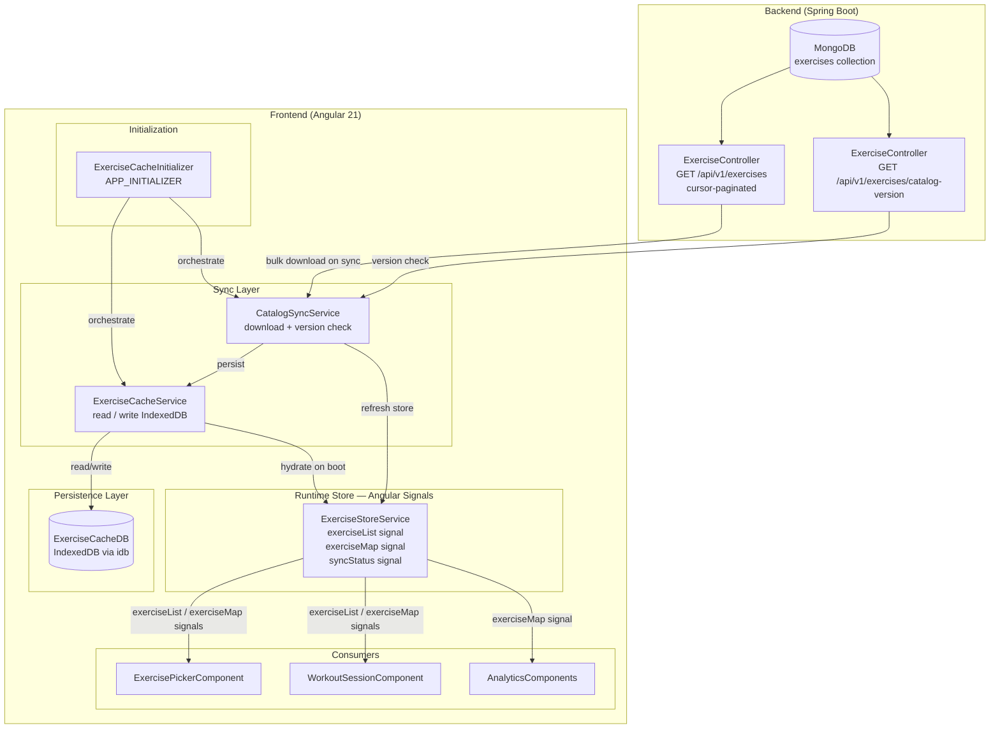
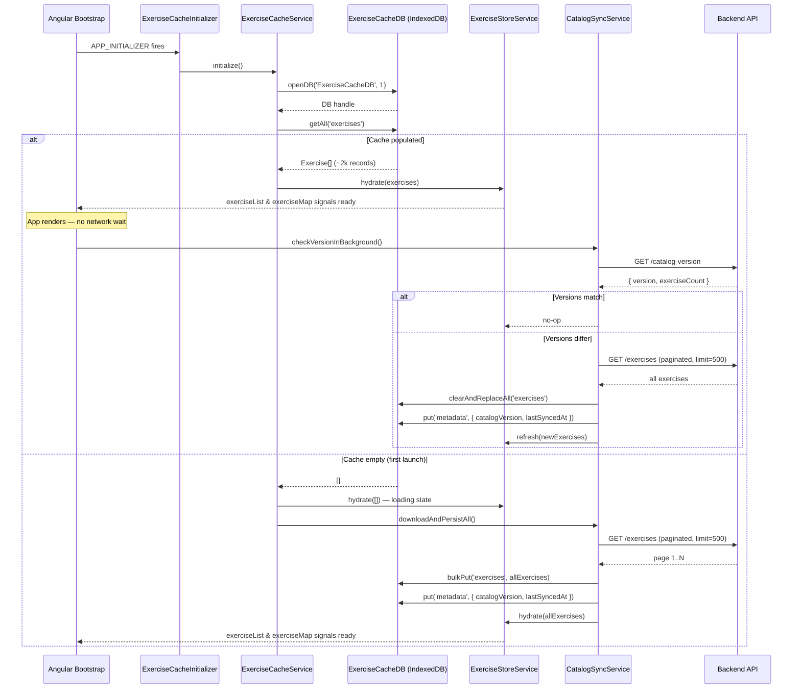
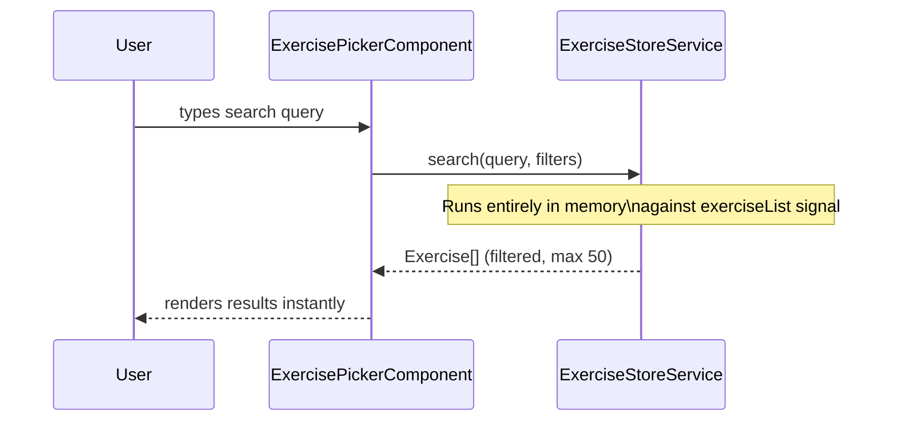

# Design Document: Exercise Catalog Cache

## Overview

The exercise catalog cache is a client-owned, offline-capable system that downloads the complete exercise catalog (~2 k exercises) from the backend on first launch and persists it in IndexedDB (`ExerciseCacheDB`). On every subsequent app start the catalog is loaded from IndexedDB into an in-memory Angular Signals store — making all exercise search, filtering, and lookup instant, network-free, and resilient to connectivity loss. A lightweight background version check determines whether the local cache needs to be refreshed against the backend.

This feature replaces the current pattern where `ExercisePickerComponent` re-fetches all exercises via paginated API calls on every mount. After this change the backend is only contacted for exercise data during first launch or when a new catalog version is detected.

---

## Architecture



---

## Startup Sequence



---

## Search & Lookup Flow



No network call, no IndexedDB read — purely in-memory signal operation.

---

## Components and Interfaces

### ExerciseCacheDB — IndexedDB Schema

**Database name**: `ExerciseCacheDB`  
**Version**: `1`

```typescript
interface ExerciseCacheSchema extends DBSchema {
  exercises: {
    key: string;                  // exerciseId
    value: CachedExercise;
    indexes: {
      'by-name': string;          // normalized lowercase name for sorted listing
      'by-type': string;          // exerciseType enum value
    };
  };
  metadata: {
    key: string;                  // 'catalog' — single record
    value: CatalogMetadata;
  };
}

interface CachedExercise {
  id: string;
  name: string;
  normalizedName: string;         // lowercase, pre-computed at write time
  primaryMuscles: string[];
  secondaryMuscles: string[];
  equipment: string[];
  exerciseType: ExerciseType;
  level: string | null;
  mechanic: string | null;
  slug: string;
  active: boolean;
  updatedAt: string;
  // NOT stored: content (overview, instructions) — fetched on demand
}

interface CatalogMetadata {
  key: 'catalog';
  catalogVersion: string;         // opaque version string from backend
  exerciseCount: number;
  lastSyncedAt: string;           // ISO 8601
}
```

**Indexes** enable sorted browsing and filtered listing without full-scan when used as a future optimisation; initial implementation reads all records into memory.

---

### ExerciseCacheService

**Responsibility**: Owns all read/write access to `ExerciseCacheDB`. No business logic — pure persistence.

```typescript
@Injectable({ providedIn: 'root' })
class ExerciseCacheService {
  /** Opens (or upgrades) the IndexedDB database. Called once at boot. */
  initialize(): Promise<void>

  /** Returns all cached exercises. Empty array if cache is empty. */
  getAllExercises(): Promise<CachedExercise[]>

  /** Replaces the entire exercises store atomically and updates metadata. */
  replaceAll(exercises: CachedExercise[], metadata: CatalogMetadata): Promise<void>

  /** Returns the stored catalog metadata, or null if not yet synced. */
  getMetadata(): Promise<CatalogMetadata | null>
}
```

**Key implementation notes**:
- `initialize()` calls `openDB('ExerciseCacheDB', 1, { upgrade })` from the `idb` library.
- `replaceAll()` uses a single `IDBTransaction` over both stores to keep exercises and metadata atomically consistent — no partial writes.
- The service never exposes the raw IDB handle outside itself.

---

### CatalogSyncService

**Responsibility**: Knows when and how to pull fresh data from the backend. Coordinates between the HTTP layer, `ExerciseCacheService`, and `ExerciseStoreService`.

```typescript
@Injectable({ providedIn: 'root' })
class CatalogSyncService {
  /**
   * Full download path — used on first launch.
   * Downloads all exercises via cursor pagination (limit=500 per page),
   * persists to IndexedDB, then hydrates the store.
   */
  downloadAndPersistAll(): Promise<void>

  /**
   * Background version check — used on subsequent launches.
   * Compares local catalogVersion to backend version.
   * Triggers full re-download only if versions differ.
   * Completes silently; errors are swallowed (cache remains valid).
   */
  checkVersionInBackground(): void

  /**
   * Fetches GET /api/v1/exercises/catalog-version.
   * Returns null on network error to allow graceful degradation.
   */
  private fetchCatalogVersion(): Observable<CatalogVersionResponse | null>

  /**
   * Fetches all exercise pages and returns a flat array.
   * Uses sequential cursor pagination, limit=500 per request.
   */
  private fetchAllExercises(): Observable<CachedExercise[]>
}
```

---

### ExerciseStoreService

**Responsibility**: Owns the runtime in-memory state. All exercise-consuming components depend solely on this service — never on `ExerciseCacheService` or `ExerciseSyncService` directly.

```typescript
@Injectable({ providedIn: 'root' })
class ExerciseStoreService {
  /** Full flat list — used for browsing and client-side search/filter. */
  readonly exerciseList: Signal<CachedExercise[]>

  /** Fast O(1) map — used for workout history, analytics, session reconstruction. */
  readonly exerciseMap: Signal<ReadonlyMap<string, CachedExercise>>

  /** 'loading' → 'ready' → 'refreshing' → 'ready' | 'error' */
  readonly syncStatus: Signal<SyncStatus>

  /** Populates both signals from an array. Called by initializer and sync service. */
  hydrate(exercises: CachedExercise[]): void

  /** Looks up a single exercise by ID. Returns undefined if not yet loaded. */
  getById(id: string): CachedExercise | undefined

  /**
   * In-memory search across exerciseList.
   * Matches name (contains, case-insensitive) + optional muscle/equipment/type filters.
   * Returns up to maxResults (default 50).
   * Never touches IDB or network.
   */
  search(query: string, filters?: ExerciseFilters, maxResults?: number): CachedExercise[]
}

type SyncStatus = 'loading' | 'ready' | 'refreshing' | 'error';

interface ExerciseFilters {
  muscle?: string;
  equipment?: string;
  exerciseType?: ExerciseType;
  level?: string;
}
```

---

### ExerciseCacheInitializer

**Responsibility**: Orchestrates the boot sequence as an Angular `APP_INITIALIZER`. Ensures the store is populated before the app renders routes.

```typescript
// Registered in app.config.ts as:
// provideAppInitializer(() => inject(ExerciseCacheInitializer).initialize())

@Injectable({ providedIn: 'root' })
class ExerciseCacheInitializer {
  async initialize(): Promise<void> {
    await this.cacheService.initialize();           // open IDB
    const cached = await this.cacheService.getAllExercises();

    if (cached.length > 0) {
      this.storeService.hydrate(cached);            // instant population
      this.syncService.checkVersionInBackground();  // fire-and-forget
    } else {
      await this.syncService.downloadAndPersistAll(); // first launch — await
    }
  }
}
```

The critical design decision here: **first launch blocks app startup** (required — no exercises = unusable app), while **subsequent launches are non-blocking** (store is immediately populated from IDB, background sync happens after render).

---

### Backend: CatalogVersionController (new endpoint)

**Responsibility**: Returns a lightweight version token the client uses to decide whether to re-sync. No authentication required — the response contains no user data.

```typescript
// GET /api/v1/exercises/catalog-version
interface CatalogVersionResponse {
  version: string;        // SHA-1 of "activeCount:latestUpdatedAt" — stable, cheap to compute
  exerciseCount: number;  // informational, used for progress display during download
}
```

Version derivation strategy on the backend (Java):
- Query `exercises` collection: `countByActiveTrue()` → count
- Query `exercises` collection: `findTopByActiveTrueOrderByUpdatedAtDesc()` → latest `updatedAt`
- Version string: `SHA1(count + ":" + updatedAt.toEpochMilli())`
- Cache this computation in-memory for 60 seconds using Spring's `@Cacheable` to keep the endpoint sub-millisecond for concurrent requests

---

## Data Models

### CachedExercise (frontend — stored in IDB and held in memory)

```typescript
interface CachedExercise {
  id: string;               // MongoDB ObjectId string — IDB primary key
  name: string;             // display name — "Barbell Back Squat"
  normalizedName: string;   // lowercase — "barbell back squat"
  primaryMuscles: string[];
  secondaryMuscles: string[];
  equipment: string[];
  exerciseType: ExerciseType;
  level: string | null;     // "beginner" | "intermediate" | "expert" | null
  mechanic: string | null;  // "compound" | "isolation" | null
  slug: string;             // URL-safe identifier
  active: boolean;
  updatedAt: string;        // ISO 8601 — used for version change detection
}
```

`content` (overview, instructions) is deliberately excluded from the cache. It is large, rarely needed, and already available via the existing `GET /exercises/:id?includeContent=true` endpoint which is only called when the user views exercise detail.

### CatalogMetadata (frontend — single IDB record)

```typescript
interface CatalogMetadata {
  key: 'catalog';
  catalogVersion: string;
  exerciseCount: number;
  lastSyncedAt: string;   // ISO 8601
}
```

### CatalogVersionResponse (backend response DTO)

```java
public record CatalogVersionResponse(
    String version,       // e.g. "a3f9c2d1..."
    int exerciseCount
) {}
```

---

## Key Algorithms

### Algorithm: Boot Initialization

```typescript
async function initializeExerciseCache(): Promise<void> {
  // Step 1: Open or upgrade IndexedDB
  await cacheService.initialize();

  // Step 2: Load persisted exercises
  const cached: CachedExercise[] = await cacheService.getAllExercises();

  if (cached.length === 0) {
    // First launch path — blocks until catalog is downloaded
    // App cannot function without exercises
    storeService.setSyncStatus('loading');
    await syncService.downloadAndPersistAll();
    // store is hydrated inside downloadAndPersistAll before this resolves
  } else {
    // Returning user path — non-blocking
    storeService.hydrate(cached);
    storeService.setSyncStatus('ready');
    // Background check: does not block app render
    syncService.checkVersionInBackground();
  }
}
```

**Preconditions:**
- IDB is available in the browser (all modern browsers, all PWA targets)
- `ExerciseCacheService.initialize()` has not been called before

**Postconditions:**
- On first launch: store is populated with full catalog before function resolves
- On returning user: store is populated with cached catalog before function resolves; background sync may update it asynchronously after

---

### Algorithm: Paginated Catalog Download

```typescript
async function fetchAllExercises(): Observable<CachedExercise[]> {
  const allExercises: CachedExercise[] = [];
  let cursor: string | undefined = undefined;
  let hasNext = true;

  while (hasNext) {
    const page = await firstValueFrom(
      http.get<ApiSuccessResponse<ExercisePage>>(
        `${baseUrl}/exercises`,
        { params: buildParams({ limit: 500, cursor }) }
      )
    );

    const mapped = page.data.items
      .filter(e => e.active)
      .map(toCachedExercise);     // strips content, adds normalizedName

    allExercises.push(...mapped);
    hasNext = page.data.hasNext;
    cursor = page.data.nextCursor ?? undefined;
  }

  return allExercises;
}
```

**Preconditions:**
- User is authenticated (JWT interceptor attaches token)
- Backend cursor pagination is stable during the download window

**Postconditions:**
- Returns complete set of active exercises
- Each item has `normalizedName` pre-computed for search performance
- `content` fields are not requested (omitted from response mapping)

**Loop invariant:** `allExercises` contains all exercises from pages 1..k after k iterations; `cursor` points to the next unread page.

---

### Algorithm: In-Memory Search

```typescript
function search(
  query: string,
  filters: ExerciseFilters = {},
  maxResults = 50
): CachedExercise[] {
  const normalizedQuery = query.toLowerCase().trim();
  const list = exerciseList();  // read signal — O(1) reference

  return list
    .filter(exercise => matchesQuery(exercise, normalizedQuery))
    .filter(exercise => matchesFilters(exercise, filters))
    .slice(0, maxResults);
}

function matchesQuery(exercise: CachedExercise, query: string): boolean {
  if (query.length < 2) return true;   // empty query = show all
  return exercise.normalizedName.includes(query);
}

function matchesFilters(exercise: CachedExercise, filters: ExerciseFilters): boolean {
  if (filters.muscle &&
      !exercise.primaryMuscles.includes(filters.muscle) &&
      !exercise.secondaryMuscles.includes(filters.muscle)) return false;
  if (filters.equipment &&
      !exercise.equipment.includes(filters.equipment)) return false;
  if (filters.exerciseType &&
      exercise.exerciseType !== filters.exerciseType) return false;
  if (filters.level &&
      exercise.level !== filters.level) return false;
  return true;
}
```

**Preconditions:**
- `exerciseList` signal has been populated (syncStatus is 'ready' or 'refreshing')
- `normalizedName` was computed at write time, not at search time

**Postconditions:**
- Returns at most `maxResults` matching exercises
- No network calls, no IDB reads, no allocations beyond the result array
- Query under 2 characters returns full unfiltered list (capped at maxResults)

**Performance:** With ~2 k exercises and `normalizedName.includes()`, a single search pass takes under 1 ms on any modern device. No debouncing of the search function itself is needed (the component may debounce the signal update by ~100 ms to avoid unnecessary re-renders).

---

### Algorithm: Background Version Check

```typescript
function checkVersionInBackground(): void {
  // Fire-and-forget — errors must not surface to the user
  http.get<ApiSuccessResponse<CatalogVersionResponse>>(
    `${baseUrl}/exercises/catalog-version`
  ).pipe(
    catchError(() => EMPTY)   // network failure = silently skip
  ).subscribe(async (res) => {
    const remote = res.data;
    const local = await cacheService.getMetadata();

    if (local === null || local.catalogVersion !== remote.version) {
      storeService.setSyncStatus('refreshing');
      await syncService.downloadAndPersistAll();
      storeService.setSyncStatus('ready');
    }
    // versions match — no action
  });
}
```

**Preconditions:**
- Store has already been populated from cache (user is not waiting on exercises)
- App is online (offline = `catchError` handles gracefully)

**Postconditions:**
- If catalog is up to date: no change to store, IDB, or UI
- If catalog has changed: store is updated with new exercises; existing UI consumers reactively re-render via signals
- Errors (network down, 5xx) are swallowed; local cache remains valid and usable

---

## Error Handling

### IDB Unavailable

**Condition**: Browser blocks IndexedDB (private browsing on Safari, storage quota exceeded).  
**Response**: `ExerciseCacheService.initialize()` throws; `ExerciseCacheInitializer` catches and falls back to in-memory-only mode (no persistence, downloads every session).  
**Recovery**: Store is still populated from the download; app functions normally but re-downloads on next launch.

### First-Launch Network Failure

**Condition**: `downloadAndPersistAll()` fails due to network error.  
**Response**: `ExerciseCacheInitializer` catches the error, sets `syncStatus` to `'error'`, and resolves the `APP_INITIALIZER` promise (so the app still renders).  
**Recovery**: Components observing `syncStatus === 'error'` show a retry affordance. `ExercisePickerComponent` displays an error state with a retry button (mirrors existing `loadError` signal pattern).

### Background Sync Failure

**Condition**: `checkVersionInBackground()` encounters a network or parse error.  
**Response**: Error is swallowed via `catchError(() => EMPTY)`. Local cache remains authoritative.  
**Recovery**: Next app restart triggers another background check. No user notification needed — the cache is still valid.

### Partial Download Failure

**Condition**: Network drops mid-pagination during `fetchAllExercises()`.  
**Response**: The entire download is abandoned. IDB is not written. Store retains its previous state (either empty loading state or prior valid cache).  
**Recovery**: `syncStatus` is set to `'error'`. App shows retry affordance. Next retry starts the paginated download from scratch.

### Stale Cache on Content Update

**Condition**: Backend adds new exercises but the version check hasn't fired yet in the current session.  
**Response**: User sees the previous catalog — this is acceptable as new exercises are not urgent.  
**Recovery**: Next app restart triggers the background version check, which detects the version change and refreshes.

---

## Migration of Existing Consumers

### ExercisePickerComponent

Current behaviour: calls `ExerciseService.list()` recursively on every mount.

After: inject `ExerciseStoreService`, remove `ExerciseService` dependency, remove `loadAll()` / `fetchPage()` methods, replace `allExercises` array with `storeService.exerciseList()` signal, wire `onQueryChange` to `storeService.search()`.

```typescript
// Before (simplified)
ngOnInit() { this.fetchPage(undefined); }
onQueryChange(q: string) {
  this.searchResults.set(
    this.allExercises.filter(e => e.name.toLowerCase().includes(q)).slice(0, 20)
  );
}

// After
protected get exercises() { return this.storeService.exerciseList(); }
protected onQueryChange(q: string) {
  this.searchResults.set(this.storeService.search(q, {}, 20));
}
```

### ExerciseService (existing)

`ExerciseService.list()` and `ExerciseService.search()` remain intact — they are still used for the admin-facing exercise browser and detail pages. No existing callers break.

The new cache services are additive; `ExerciseService` is not deleted or modified.

---

## Testing Strategy

### Unit Testing Approach

- `ExerciseCacheService`: test with a real IDB mock (`fake-indexeddb` or vitest's `structuredClone` sandbox). Verify `replaceAll()` atomicity — if the exercises store write succeeds but metadata fails, neither should be committed.
- `ExerciseStoreService.search()`: property-based test. For any list of exercises, `search('')` returns all; `search(q)` where `q.length < 2` returns all; results never exceed `maxResults`; every result's `normalizedName` contains the query.
- `CatalogSyncService.checkVersionInBackground()`: mock HTTP + cacheService. Verify that when versions match no `replaceAll()` call is made; when versions differ `replaceAll()` is called exactly once.
- `ExerciseCacheInitializer`: verify that `downloadAndPersistAll()` is awaited on first launch and `checkVersionInBackground()` is called (not awaited) on returning user.

### Property-Based Testing

Key invariant for `ExerciseStoreService`:

> For any valid exercise list `L` passed to `hydrate(L)`:
> - `exerciseList().length === L.filter(e => e.active).length` (inactive exercises are excluded)
> - `exerciseMap().size === exerciseList().length`
> - For every `e` in `exerciseList()`: `exerciseMap().get(e.id) === e`
> - `search(q).every(e => e.normalizedName.includes(q.toLowerCase()))` for `q.length >= 2`

**Library**: vitest (already in project `devDependencies`)

### Integration Testing

- Boot sequence: mount a minimal Angular app with `ExerciseCacheInitializer` as `APP_INITIALIZER`; mock IDB and HTTP; assert that signals are populated and `syncStatus` reaches `'ready'` before the promise resolves.
- Background sync: assert that after `checkVersionInBackground()` resolves with a changed version, `exerciseList()` reflects the updated catalog.

---

## Performance Considerations

| Concern | Target | Approach |
|---|---|---|
| Time to first exercise search (returning user) | < 200 ms | IDB `getAll()` is the only blocking operation; ~2k records serialize in ~50 ms |
| Search latency (per keystroke) | < 5 ms | In-memory `Array.filter` on 2k items; `normalizedName` pre-computed |
| Memory footprint (2k exercises) | < 3 MB | ~1.5 KB per exercise × 2k = ~3 MB; well within mobile budget |
| First-launch download (2k exercises, limit=500) | 4 HTTP pages | Each page ~500 exercises; background progress can be shown via `exerciseCount` from version endpoint |
| IDB write (initial persist) | Single transaction | `idb` bulk put in one transaction; no per-record writes |
| Scale to 10k exercises | Supported | `normalizedName.includes()` on 10k items ≈ 1–2 ms; IDB bulk write remains single transaction; memory ~15 MB |

---

## Security Considerations

- The `/catalog-version` endpoint exposes only aggregate metadata (count + opaque hash). No exercise content is returned. It can be made public (no auth) since the exercises catalog itself is already accessible to authenticated users.
- IndexedDB data is stored in the browser's origin-isolated storage. No sensitive user data is stored in `ExerciseCacheDB` — only public exercise catalog information.
- The `replaceAll()` transaction prevents a corrupted partial write from leaving IDB in an inconsistent state.
- The backend version hash (`SHA1(count:updatedAt)`) is opaque — it reveals nothing about the shape of catalog changes.

---

## Dependencies

| Dependency | Scope | Purpose |
|---|---|---|
| `idb` (jakearchibald/idb) | frontend runtime | Type-safe IndexedDB wrapper; promisified API |
| Angular Signals (`@angular/core`) | frontend runtime | Already in use — reactive store |
| `@angular/core/APP_INITIALIZER` | frontend runtime | Boot-time initializer hook |
| Spring Cache (`@Cacheable`) | backend | In-memory caching of version computation |
| Spring Security | backend | Existing JWT auth on all existing endpoints; catalog-version endpoint will be public |

`idb` is not currently in `package.json` and must be added: `npm install idb`.

---

## File Structure

New files to be created:

```
frontend/src/app/features/exercises/
├── cache/
│   ├── exercise-cache.db.ts          # IDB schema + openDB call (ExerciseCacheService)
│   ├── exercise-cache.service.ts     # Persistence CRUD
│   ├── catalog-sync.service.ts       # Download + version check
│   ├── exercise-store.service.ts     # Runtime signals store
│   ├── exercise-cache.initializer.ts # APP_INITIALIZER orchestrator
│   └── exercise-cache.models.ts      # CachedExercise, CatalogMetadata, types

backend/src/main/java/com/liftorium/
├── dto/CatalogVersionResponse.java   # New response record
├── service/CatalogVersionService.java # Hash computation + @Cacheable
└── controller/ExerciseController.java # Add GET /catalog-version endpoint
```

Files modified:

```
frontend/src/app/app.config.ts                         # Register APP_INITIALIZER
frontend/src/app/shared/ui/exercise-picker/exercise-picker.ts  # Use ExerciseStoreService
```

---

## Correctness Properties

*A property is a characteristic or behavior that should hold true across all valid executions of a system — essentially, a formal statement about what the system should do. Properties serve as the bridge between human-readable specifications and machine-verifiable correctness guarantees.*

### Property 1: Map–List Consistency

*For any* array of exercises `L` passed to `hydrate(L)`, after hydration completes: `exerciseMap().size === exerciseList().length`, and for every exercise `e` in `exerciseList()`, `exerciseMap().get(e.id) === e` and `getById(e.id) === e`. The map, list, and lookup method are always derived from the same hydration call and never diverge.

**Validates: Requirements 5.4, 5.6, 5.7**

---

### Property 2: Search Soundness

*For any* non-empty trimmed query string `q` and any exercise list loaded into the store, every result `r` returned by `search(q)` satisfies `r.normalizedName.includes(q.toLowerCase().trim())`. No result is returned that does not match the query.

**Validates: Requirements 6.3**

---

### Property 3: Search Completeness

*For any* non-empty trimmed query string `q` and any exercise list loaded into the store, every exercise `e` in `exerciseList()` where `e.normalizedName.includes(q.toLowerCase().trim())` is included in `search(q, {}, Infinity)`. No matching exercise is silently omitted unless `maxResults` truncation applies.

**Validates: Requirements 6.3**

---

### Property 4: Filter Soundness

*For any* combination of `ExerciseFilters` and any exercise list, every exercise `r` returned by `search(q, filters)` satisfies all of the following that are present in `filters`: `r.primaryMuscles` or `r.secondaryMuscles` includes the `muscle` value; `r.equipment` includes the `equipment` value; `r.exerciseType === filters.exerciseType`; `r.level === filters.level`. Adding more filter constraints never increases the result count: `|search(q, f1 ∪ f2)| ≤ |search(q, f1)|`.

**Validates: Requirements 6.4, 6.5, 6.6, 6.7, 6.8**

---

### Property 5: Search Result Cap

*For any* query, filter combination, and exercise list, `search(q, filters, maxResults).length ≤ maxResults`. When `maxResults` is not provided, the result length never exceeds `50`.

**Validates: Requirements 6.9**

---

### Property 6: IDB Atomicity and Rollback

*For any* exercises array and metadata passed to `replaceAll()`, if the operation completes successfully then `getAllExercises().length === exercises.length` and `getMetadata().catalogVersion === metadata.catalogVersion`. If `replaceAll()` or the containing `downloadAndPersistAll()` fails for any reason, the resulting IndexedDB state is identical to the state before the call — no partial writes are observable.

**Validates: Requirements 1.7, 1.8, 9.5**

---

### Property 7: Idempotent Hydration

*For any* exercise array `L`, calling `hydrate(L)` twice produces the same `exerciseList`, `exerciseMap`, and `syncStatus` signal state as calling it once. The store does not accumulate duplicates or diverge across repeated hydrations.

**Validates: Requirements 5.5**

---

### Property 8: normalizedName Persistence

*For any* `CachedExercise` written to IndexedDB via `replaceAll()`, the persisted `normalizedName` field equals `exercise.name.toLowerCase()`. This holds for all exercises regardless of the original name casing.

**Validates: Requirements 1.5**

---

### Property 9: Active Exercise Filtering

*For any* set of exercises fetched from the backend containing a mix of `active: true` and `active: false` records, after `downloadAndPersistAll()` completes, `getAllExercises()` returns only records where `active === true`. No inactive exercise is ever persisted to or served from the cache.

**Validates: Requirements 3.3**

---

### Property 10: Pagination Completeness

*For any* backend catalog divided into `N` pages via cursor pagination, `downloadAndPersistAll()` fetches all `N` pages before calling `replaceAll()`. The exercises passed to `replaceAll()` contain the union of all active exercises from all pages, with no page skipped or duplicated.

**Validates: Requirements 3.2**

---

### Property 11: Catalog Version Determinism

*For any* database state with a known count of active exercises `C` and a most-recently-updated timestamp `T`, the `version` field returned by `GET /api/v1/exercises/catalog-version` equals `SHA1(C + ":" + T.toEpochMilli())`. The same database state always produces the same version string.

**Validates: Requirements 7.3, 7.6**

---

### Property 12: Background Sync Continuity

*For any* exercise list `L` that has been hydrated into the store, while a background refresh is in progress (`syncStatus === 'refreshing'`), `exerciseList()` continues to return `L` to all consumers. The previous catalog is never replaced with an empty or partial list mid-refresh.

**Validates: Requirements 4.7, 9.7**
