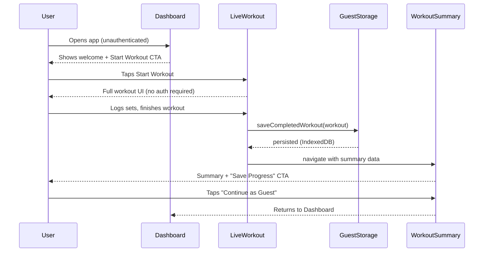
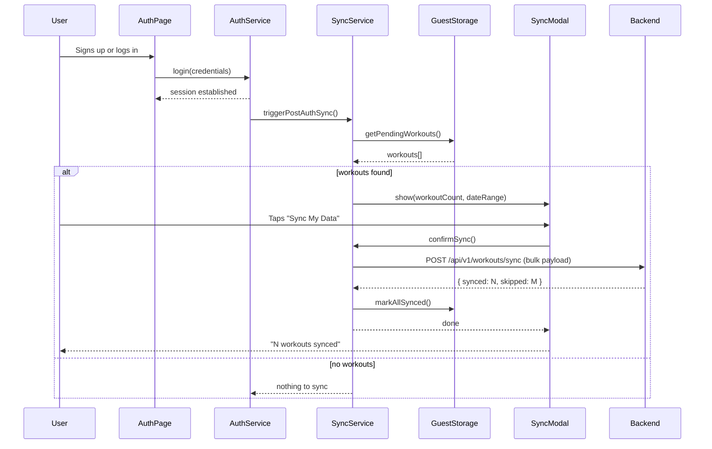
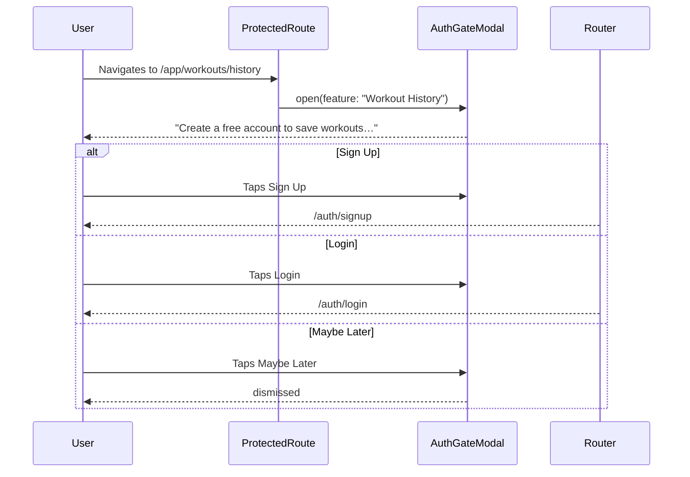

# Design Document: Guest-First Onboarding & Workout Sync

## Overview

This feature transforms the app's entry point from a mandatory login wall into a guest-first experience where users land directly on the Dashboard, can perform full workouts locally, and are invited to create an account only after generating value. When they do authenticate, locally stored guest workouts sync automatically to the backend.

The change touches three layers: Angular routing and guards (make Dashboard the public default), a new `GuestWorkoutStorageService` backed by IndexedDB with localStorage fallback (persist guest workouts across sessions), and a new `WorkoutSyncService` plus a backend bulk-import endpoint (upload and deduplicate guest workouts on sign-in).

---

## Architecture

```mermaid
graph TD
    subgraph Angular Frontend
        Router["App Router"]
        AuthGuard["AuthGuard (protected routes)"]
        GuestAccessGuard["GuestAccessGuard (public routes)"]
        AuthGateModal["AuthGateModal"]
        NavBar["NavBar (dynamic auth buttons)"]

        subgraph Core Services
            AuthService["AuthService (Signals)"]
            GuestStorage["GuestWorkoutStorageService (IndexedDB/LS)"]
            SyncService["WorkoutSyncService"]
        end

        subgraph Feature Pages
            Dashboard["Dashboard (guest-aware)"]
            LiveWorkout["LiveWorkoutPage"]
            WorkoutSummary["WorkoutSummaryPage"]
            History["WorkoutHistoryPage (auth-gated)"]
            Analytics["ProgressPage (auth-gated)"]
            PRTracking["PRTracking (auth-gated)"]
            Profile["ProfilePage (auth-gated)"]
        end

        subgraph Modals
            SyncModal["WorkoutSyncModal"]
            AuthModal["AuthGateModal"]
        end
    end

    subgraph Spring Boot Backend
        SyncController["POST /api/v1/workouts/sync (new)"]
        WorkoutController["WorkoutController (existing)"]
        AuthController["AuthController (existing)"]
    end

    Router -->|unauthenticated| Dashboard
    Router -->|protected route attempt| AuthGuard
    AuthGuard -->|not authed| AuthGateModal
    AuthService -->|status signal| NavBar
    AuthService -->|on login/signup| SyncService
    SyncService -->|reads| GuestStorage
    SyncService -->|POST bulk| SyncController
    LiveWorkout -->|saves completed workout| GuestStorage
    Dashboard -->|feature locked| AuthModal
    SyncModal -->|user confirms| SyncService
```



---

## Sequence Diagrams

### Guest Workout Flow



### Sync-on-Authentication Flow



### Auth-Gate Modal Flow



---

## Components and Interfaces

### NavBarComponent

**Purpose**: Renders top-level navigation. Shows Login + Sign Up buttons when guest, user avatar/menu when authenticated.

**Interface**:
```typescript
// Reads auth state reactively via signal
protected readonly authStatus = this.authService.status; // Signal<AuthStatus>
protected readonly user = this.authService.user;         // Signal<AuthUser | null>
```

**Responsibilities**:
- Display Login and Sign Up buttons when `authStatus() === 'anonymous'`
- Display user avatar/menu when `authStatus() === 'authenticated'`
- Show skeleton/spinner during `'checking'` state

---

### GuestWorkoutStorageService

**Purpose**: Persists guest workout data locally using IndexedDB with localStorage as fallback. Survives page refreshes and browser restarts.

**Interface**:
```typescript
interface GuestWorkoutStorageService {
  saveActiveWorkout(workout: LiveWorkout): Promise<void>;
  loadActiveWorkout(): Promise<LiveWorkout | null>;
  clearActiveWorkout(): Promise<void>;

  saveCompletedWorkout(workout: GuestCompletedWorkout): Promise<void>;
  getPendingWorkouts(): Promise<GuestCompletedWorkout[]>;
  markWorkoutsSynced(ids: string[]): Promise<void>;
  clearSyncedWorkouts(): Promise<void>;

  readonly storageType: Signal<'indexeddb' | 'localstorage'>;
}
```

**Responsibilities**:
- Initialize IndexedDB on first use; fall back to localStorage if unavailable
- Store active workout session (replaces the current `localStorage` direct access in `LiveWorkoutStore`)
- Store completed workouts awaiting sync with a `synced: false` flag
- Mark records as synced without deleting them (audit trail)

---

### WorkoutSyncService

**Purpose**: Orchestrates the post-authentication sync of guest workout data to the backend.

**Interface**:
```typescript
interface WorkoutSyncService {
  readonly syncState: Signal<SyncState>;
  readonly pendingCount: Signal<number>;

  checkForPendingWorkouts(): Promise<SyncPreview | null>;
  executeSync(): Observable<SyncResult>;
  dismissSync(): void;
}

type SyncState = 'idle' | 'checking' | 'pending' | 'syncing' | 'done' | 'error';

type SyncPreview = {
  count: number;
  earliestDate: string;
  latestDate: string;
};

type SyncResult = {
  synced: number;
  skipped: number;
};
```

**Responsibilities**:
- Called by `AuthService` after successful login/signup
- Read pending workouts from `GuestWorkoutStorageService`
- Build the bulk sync payload
- Call `POST /api/v1/workouts/sync`
- Mark local records as synced on success
- Expose reactive state for the `WorkoutSyncModalComponent`

---

### AuthGateModalComponent

**Purpose**: Overlay shown when a guest user attempts to access a protected feature. Replaces hard redirects.

**Interface**:
```typescript
@Input() featureName: string;  // e.g. "Workout History"
@Output() dismissed = new EventEmitter<void>();

// Usage
<app-auth-gate-modal featureName="Workout History" (dismissed)="onDismiss()" />
```

**Responsibilities**:
- Display feature-specific messaging
- Provide Sign Up, Login, Maybe Later actions
- Emit `dismissed` so the calling component can close it

---

### WorkoutSyncModalComponent

**Purpose**: Shown after authentication when pending guest workouts are detected.

**Interface**:
```typescript
@Input() preview: SyncPreview;
@Output() confirmed = new EventEmitter<void>();
@Output() skipped = new EventEmitter<void>();
```

**Responsibilities**:
- Display workout count and date range
- Confirm or skip sync
- Show progress indicator during sync

---

### WorkoutSummaryPageComponent (enhanced)

**Purpose**: Already exists as part of workout completion. Enhanced to show "Save Progress" CTA for unauthenticated users.

**New behaviour**:
- When `authStatus() === 'anonymous'`: Show "Your workout is stored locally" banner + Create Account / Login / Continue as Guest buttons
- When authenticated: Show normal completion actions (view history, start new workout)

---

### GuestDashboardComponent

**Purpose**: Welcome dashboard shown to unauthenticated users. Embedded inside `DashboardPageComponent` via conditional rendering.

**Responsibilities**:
- Display prominent Start Workout CTA
- Show feature cards: Workout Tracking, Progressive Overload, Analytics, PR Tracking
- Protected feature cards show a lock icon; tapping them opens `AuthGateModal`

---

## Data Models

### GuestCompletedWorkout

```typescript
type GuestCompletedWorkout = {
  id: string;                  // client-generated UUID
  name: string;
  startedAt: number;           // epoch ms
  finishedAt: number;          // epoch ms
  accumulatedMs: number;
  exercises: WorkoutExercise[]; // existing type from live-workout.models.ts
  synced: boolean;
  syncedAt: string | null;     // ISO timestamp
  createdLocally: string;      // ISO timestamp
};
```

**Validation Rules**:
- `id` must be a valid UUID
- `startedAt` must be before `finishedAt`
- `exercises` may be empty (empty workout is valid)
- `synced` defaults to `false` on creation

---

### SyncBulkRequest (backend DTO)

```typescript
// Frontend payload shape
type SyncBulkRequest = {
  workouts: GuestWorkoutPayload[];
};

type GuestWorkoutPayload = {
  clientId: string;            // original guest UUID for dedup
  name: string;
  startedAt: string;           // ISO
  finishedAt: string;          // ISO
  durationSeconds: number;
  exercises: {
    exerciseId: string;
    sets: {
      reps: number;
      weight: number;
      completedAt: string | null;
    }[];
  }[];
};
```

---

### IndexedDB Schema

```
Database: liftorium_guest_db (version 1)

Object Store: active_workout
  keyPath: 'key'              // single record, key = 'current'

Object Store: completed_workouts
  keyPath: 'id'
  Indexes:
    synced (non-unique)        // for querying pending workouts
    startedAt (non-unique)     // for date-range preview
```

---

## Route Configuration

```typescript
// Updated app.routes.ts
export const routes: Routes = [
  {
    path: '',
    pathMatch: 'full',
    redirectTo: 'app'          // Dashboard is now the default
  },
  {
    path: 'auth',
    canActivate: [guestGuard], // unchanged — redirects authenticated users to /app
    loadChildren: () => import('./features/auth/auth.routes').then(m => m.authRoutes)
  },
  {
    path: 'app/workout',
    // NO authGuard — accessible to guests
    loadComponent: () => import('./features/workouts/live-workout-page/live-workout-page')
      .then(m => m.LiveWorkoutPageComponent)
  },
  {
    path: 'app/exercises',
    // NO authGuard — accessible to guests
    loadChildren: () => import('./features/exercises/exercises.routes').then(m => m.exercisesRoutes)
  },
  {
    path: 'app/workouts/history',
    canActivate: [authGuard],  // protected — shows AuthGateModal via guard
    loadComponent: () => import('./features/workouts/workout-history-page/workout-history-page')
      .then(m => m.WorkoutHistoryPageComponent)
  },
  {
    path: 'app/workouts/:workoutId',
    canActivate: [authGuard],
    loadComponent: () => import('./features/workouts/workout-detail-page/workout-detail-page')
      .then(m => m.WorkoutDetailPageComponent)
  },
  {
    path: 'app/plan',
    canActivate: [authGuard],
    loadComponent: () => import('./features/plan/plan-page/plan-page').then(m => m.PlanPageComponent)
  },
  {
    path: 'app/progress',
    canActivate: [authGuard],
    loadChildren: () => import('./features/progress/progress.routes').then(m => m.progressRoutes)
  },
  {
    path: 'app',
    // NO authGuard — Dashboard is public
    loadComponent: () => import('./features/dashboard/dashboard-page/dashboard-page')
      .then(m => m.DashboardPageComponent)
  },
  {
    path: '**',
    redirectTo: 'app'          // fallback to Dashboard, not login
  }
];
```

**Auth Guard behaviour change**: When `authGuard` blocks a guest, it no longer issues a hard `router.createUrlTree(['/auth/login'])` redirect. Instead it sets a signal (`AuthGateService.pendingFeature`) and returns `false`, leaving navigation in place. A top-level `AuthGateModalComponent` in `app.html` listens to that signal and opens the modal.

---

## Error Handling

### IndexedDB Unavailable

**Condition**: Browser blocks IndexedDB (private mode in some browsers, storage quota exceeded).
**Response**: `GuestWorkoutStorageService` catches the open error and sets `storageType` signal to `'localstorage'`. All subsequent reads/writes use localStorage with the same key contract.
**Recovery**: Automatic. No user-facing error unless both storage mechanisms fail.

### Sync Network Failure

**Condition**: `POST /api/v1/workouts/sync` returns a network error or 5xx.
**Response**: `WorkoutSyncService` sets `syncState` to `'error'`. The modal shows "Sync failed — try again later." Workouts remain in local storage with `synced: false`.
**Recovery**: User can retry from the Dashboard via a "Pending sync" nudge card, or workouts sync automatically on next login from any device.

### Partial Sync / Deduplication

**Condition**: Some workouts already exist in the backend (user previously synced from another device).
**Response**: Backend returns `{ synced: N, skipped: M }`. The frontend marks all submitted records as synced regardless, preventing future duplicate attempts.
**Recovery**: No action required; data integrity is preserved.

### Stale Active Workout (Day Boundary)

**Condition**: An active guest workout started on a previous day is found in storage.
**Response**: `GuestWorkoutStorageService.loadActiveWorkout()` detects the stale date, auto-completes it into `completed_workouts` with `synced: false`, and returns `null` for the active workout.
**Recovery**: The workout is available for sync. The existing stale-workout notification mechanism (`liftorium_stale_workout_notification`) continues to function.

---

## Backend: Bulk Sync Endpoint

### Endpoint

```
POST /api/v1/workouts/sync
Authorization: Bearer <token>
Content-Type: application/json
```

### Request Body

```json
{
  "workouts": [
    {
      "clientId": "uuid-from-client",
      "name": "Today",
      "startedAt": "2025-01-15T08:00:00Z",
      "finishedAt": "2025-01-15T09:10:00Z",
      "durationSeconds": 4200,
      "exercises": [
        {
          "exerciseId": "mongo-exercise-id",
          "sets": [
            { "reps": 8, "weight": 80.0, "completedAt": "2025-01-15T08:15:00Z" }
          ]
        }
      ]
    }
  ]
}
```

### Response Body

```json
{
  "data": {
    "synced": 3,
    "skipped": 1
  }
}
```

### Deduplication Strategy

The backend stores the `clientId` on the `Workout` document. On each sync request, it queries `workouts` by `{ userId, clientId: { $in: incomingClientIds } }` to find existing records. Any workout whose `clientId` already exists is counted as `skipped` and not re-imported.

### Backend DTO (Java)

```java
// WorkoutDtos.java — additions
public record SyncWorkoutSetRequest(
    @NotNull @Min(0) @Max(1000) Integer reps,
    @NotNull @Min(0) @Max(2000) Double weight,
    String completedAt
) {}

public record SyncWorkoutExerciseRequest(
    @NotBlank String exerciseId,
    @NotNull List<SyncWorkoutSetRequest> sets
) {}

public record SyncWorkoutRequest(
    @NotBlank String clientId,
    @NotBlank @Size(max = 120) String name,
    @NotNull String startedAt,
    @NotNull String finishedAt,
    @Min(0) Integer durationSeconds,
    @NotNull List<SyncWorkoutExerciseRequest> exercises
) {}

public record SyncBulkRequest(
    @NotNull @Size(min = 1, max = 50) List<SyncWorkoutRequest> workouts
) {}

public record SyncBulkResponse(
    int synced,
    int skipped
) {}
```

### Workout Entity Addition

```java
// Workout.java — add field
@Indexed
private String clientId;  // nullable; set only for guest-synced workouts
```

---

## Testing Strategy

### Unit Testing

- `GuestWorkoutStorageService`: Test IndexedDB path and localStorage fallback path independently using fake IndexedDB implementations.
- `WorkoutSyncService`: Test `checkForPendingWorkouts()` returns correct preview, `executeSync()` builds the correct payload, and handles error states.
- `AuthGuard` (updated): Verify that on unauthenticated access it does not redirect but instead sets the `AuthGateService.pendingFeature` signal.
- Backend `WorkoutSyncService`: Test deduplication logic — same `clientId` on second call is skipped.

### Property-Based Testing

**Property Test Library**: fast-check (frontend)

Key properties to verify:
- For any list of `GuestCompletedWorkout[]`, the sync payload builder always produces a valid `SyncBulkRequest` with `clientId` matching the source `id`.
- `GuestWorkoutStorageService.markWorkoutsSynced(ids)` is idempotent: calling it twice with the same IDs produces the same final state.
- Deduplication on the backend: syncing the same workout N times results in exactly 1 stored record and `skipped === N-1`.

### Integration Testing

- Full guest-to-authenticated flow: start app unauthenticated → complete a workout → sign up → confirm sync modal → verify workout appears in history.
- Verify that existing authenticated user flows are not broken by the routing change (login → dashboard → workout history still works).
- Verify the `guestGuard` still redirects authenticated users away from `/auth`.

---

## Performance Considerations

- IndexedDB reads during app boot are async; the active workout load does not block the Angular bootstrap — the `LiveWorkoutStore` initializes with `null` and hydrates asynchronously.
- The `completed_workouts` object store is indexed on `synced` so the query for pending workouts (`synced === false`) is O(log n), not a full scan.
- Sync payload is capped at 50 workouts per request (`@Size(max = 50)`) to prevent oversized requests. Clients with more than 50 pending workouts will batch.
- The existing `LiveWorkoutStore.persist()` localStorage call will delegate to `GuestWorkoutStorageService.saveActiveWorkout()`. The async write is fire-and-forget from the store's perspective (mirroring the current try/catch pattern).

---

## Security Considerations

- The new `POST /api/v1/workouts/sync` endpoint is fully authenticated (`anyRequest().authenticated()` in `SecurityConfig`). No guest data reaches the backend without a valid JWT.
- `clientId` is a client-generated UUID and is only used for deduplication scoped to a single `userId`. A user cannot reference or overwrite another user's workout by submitting a matching `clientId`.
- All incoming sync data is validated with Jakarta Validation annotations (`@NotBlank`, `@Min`, `@Max`, `@Size`). The `exerciseId` is validated against the exercise collection before being stored.
- Guest data in IndexedDB is scoped to the origin and is never transmitted to the backend without explicit user action (confirming the sync modal).

---

## Correctness Properties

*A property is a characteristic or behavior that should hold true across all valid executions of a system — essentially, a formal statement about what the system should do. Properties serve as the bridge between human-readable specifications and machine-verifiable correctness guarantees.*

### Property 1: Guest data isolation

*For any* authentication event (login or signup), the `WorkoutSyncService` SHALL only call `POST /api/v1/workouts/sync` after the user has explicitly confirmed the `WorkoutSyncModal`. No guest workout data is transmitted without that confirmation.

**Validates: Requirements 22.1**

---

### Property 2: No data loss on authentication

*For any* set of `GuestCompletedWorkout` records with `synced: false` present at the time `executeSync()` is called, after a successful sync response every record is either reflected in the backend (`synced` count) or counted as `skipped` due to deduplication. No workout is silently dropped.

**Validates: Requirements 14.2, 14.3, 14.5, 16.2**

---

### Property 3: Backend sync idempotency

*For any* valid `SyncBulkRequest` payload submitted to `POST /api/v1/workouts/sync` for the same authenticated user, submitting the same payload N times produces the same backend state as submitting it once — exactly one stored workout record per unique `clientId` per user, with all extras counted as `skipped`.

**Validates: Requirements 17.1, 17.2, 19.2**

---

### Property 4: Auth-gate preserves navigation intent

*For any* protected route URL that an unauthenticated user attempts to navigate to, when `AuthGuard` blocks access it preserves the attempted URL as a `returnUrl` and sets `AuthGateService.pendingFeature` without issuing a hard URL redirect.

**Validates: Requirements 9.1, 9.7**

---

### Property 5: Existing authenticated flows unchanged

*For any* route that was accessible to an authenticated user before this change, after this change the `AuthGuard` continues to allow navigation to that route without triggering `AuthGateModal`.

**Validates: Requirements 23.1, 23.2**

---

### Property 6: Storage fallback round-trip

*For any* valid `LiveWorkout` or `GuestCompletedWorkout` object, saving it via `GuestWorkoutStorageService` and then loading it back produces an equivalent object — regardless of whether the active storage backend is IndexedDB or localStorage.

**Validates: Requirements 4.1, 4.2, 4.4, 20.2, 21.1**

---

### Property 7: Active workout continuity

*For any* in-progress guest workout persisted to `GuestWorkoutStorageService` before a page refresh, `loadActiveWorkout()` returns the previously saved `LiveWorkout` object so the session can be resumed seamlessly.

**Validates: Requirements 21.1, 21.2**

---

### Property 8: Dashboard is always the unauthenticated landing page

*For any* unrecognised path or the root path `''`, the router redirects to `/app`, which renders `DashboardPageComponent` without requiring authentication — even while `AuthStatus` is `'checking'`.

**Validates: Requirements 1.1, 1.2, 1.3, 1.4**

---

### Property 9: Completed workout synced flag invariant

*For any* `GuestCompletedWorkout` created via `saveCompletedWorkout()`, the record is stored with `synced` set to `false` and `syncedAt` set to `null`.

**Validates: Requirements 4.7, 7.2, 7.3**

---

### Property 10: Stale active workout auto-completion

*For any* active workout stored in `GuestWorkoutStorageService` whose `startedAt` date is prior to the current calendar day, calling `loadActiveWorkout()` moves the workout to `completed_workouts` with `synced: false`, clears the `active_workout` store, and returns `null`.

**Validates: Requirements 5.1, 5.2, 5.3**

---

### Property 11: Pending workouts query correctness

*For any* set of `GuestCompletedWorkout` records in storage with a mixture of `synced: true` and `synced: false` values, `getPendingWorkouts()` returns exactly the subset where `synced` is `false` — no more, no less.

**Validates: Requirements 8.1**

---

### Property 12: markWorkoutsSynced idempotency

*For any* set of workout IDs, calling `markWorkoutsSynced(ids)` once or multiple times produces the same final state: every matching record has `synced: true` and a non-null `syncedAt` timestamp, and records already marked synced are left unchanged.

**Validates: Requirements 8.2, 8.3, 19.1**

---

### Property 13: Sync payload integrity

*For any* non-empty list of `GuestCompletedWorkout` objects passed to the payload builder, the resulting `SyncBulkRequest` satisfies: (a) every `clientId` matches the source `GuestCompletedWorkout.id`; (b) `startedAt` and `finishedAt` are valid ISO 8601 strings; (c) `durationSeconds` is a non-negative integer.

**Validates: Requirements 14.3, 18.1, 18.2, 18.3**

---

### Property 14: Sync state preserved on failure

*For any* sync attempt where `POST /api/v1/workouts/sync` returns a network error or 5xx response, all `GuestCompletedWorkout` records that were pending at the time of the call retain `synced: false` — no records are mutated on failure.

**Validates: Requirements 15.1, 15.3**

---

### Property 15: Backend input validation

*For any* `SyncWorkoutRequest` where `reps` is outside the range 0–1000 or `weight` is outside 0–2000, the `SyncController` rejects the request with a 400 response. Similarly, requests with zero workouts or more than 50 workouts are rejected with a 400 response.

**Validates: Requirements 16.6, 16.7, 16.8**

---

### Property 16: User-scoped deduplication isolation

*For any* two distinct authenticated users who submit identical `clientId` values to `POST /api/v1/workouts/sync`, each user's workout record is stored and deduplicated independently — one user's `clientId` cannot affect or overwrite the other user's records.

**Validates: Requirements 22.3, 16.3**

---

### Property 17: Sync preview accuracy

*For any* non-empty set of pending `GuestCompletedWorkout` records, the `SyncPreview` returned by `checkForPendingWorkouts()` accurately reflects the `count`, `earliestDate`, and `latestDate` of those records.

**Validates: Requirements 13.2**

---

### Property 18: Auth-gated feature lock icons

*For any* protected feature card rendered by `GuestDashboardComponent`, the card displays a lock icon and opening it triggers `AuthGateModal` with the correct feature name.

**Validates: Requirements 2.3, 2.4**

---

## Dependencies

### Frontend (no new packages required)
- Angular 19+ — Signals, standalone components, lazy routing (already in use)
- `idb` npm package — thin typed wrapper around the IndexedDB API (lightweight, widely used)
- TailwindCSS — existing styling system

### Backend (no new packages required)
- Spring Boot 4.x, Spring Data MongoDB, Spring Security, Jakarta Validation — all already in `pom.xml`
- Lombok — already in `pom.xml`
