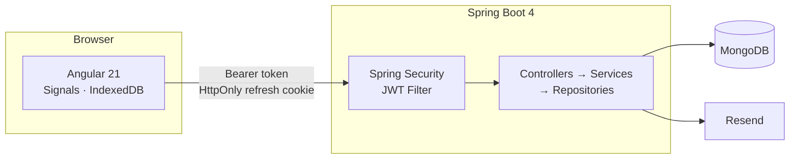

# Liftorium

A workout tracking application built for real gym usage — fast, focused, and mobile-first.

---

## Product Overview

Liftorium is a full-stack workout tracker built around one constraint: it has to be usable mid-set, with one hand, under a barbell.

Most tracking apps optimise for data completeness over speed. Liftorium inverts that priority. The workflow minimises taps during a live session — logging a set should take seconds, not a navigation sequence. The exercise catalog is cached locally so the app works without a reliable gym connection.

Beyond live logging, Liftorium tracks progression automatically. When a workout is finished, the backend runs a PR evaluation engine that compares each exercise against your all-time bests and records personal records without any manual input.

---

## Why Liftorium?

| Problem | Liftorium's approach |
|---|---|
| Other apps require login before you can log anything | Guest mode — start tracking immediately, sync after signup |
| Logging a set mid-workout requires too many taps | Signal-based live state, no round-trips during active sets |
| Progress tracking requires manual note-keeping | Automatic PR detection on every finished workout |
| Apps break in poor gym connectivity | Exercise catalog cached in IndexedDB, works offline |
| One-size-fits-all set tracking | Four tracking types: weight/reps, reps-only, duration, cardio |

---

## Current Status

**Active development. Core backend is production-ready. Frontend is partially connected.**

### Complete

- Authentication — registration with OTP email verification, login, forgot password, JWT session management
- Workout tracking — live session logging, rest timer, workout plans (backend + frontend)
- Exercise catalog — paginated catalog with search and muscle/equipment filters (backend)
- Progress engine — automatic PR detection and history snapshots on every finished workout (backend)
- Offline guest mode — full workout logging before signup, synced to backend on login
- User settings — weight unit, distance unit, rest timer defaults, theme

### In Progress

- Exercise catalog — frontend browsing and search UI
- Workout history — completed workout list and detail views

### Planned

- Progress analytics — volume and trend summaries
- PR tracking — personal records browser

See the [MVP Roadmap](./docs/progress/mvp-roadmap.md) and [Open Tasks](./docs/progress/open-tasks.md) for full detail.

---

## Features

### Authentication

- Email registration with OTP email verification
- Email and password login
- Forgot password with OTP-verified reset
- JWT dual-token sessions: short-lived access token, long-lived refresh token
- Automatic token refresh — a failed request retries transparently after a token refresh
- Secure logout

### Exercise Management

- Publicly accessible exercise catalog — no login required
- Search by name, target muscle group, and equipment
- Four tracking types per exercise: weight and reps, reps only, duration, cardio
- Client-side catalog cache for offline access

### Workout Tracking

- Start, pause, resume, and finish workout sessions
- Add, remove, reorder, and replace exercises during a live session
- Per-tracking-type set logging: weight, reps, duration, distance, speed, incline
- Automatic rest timer after each completed set
- Guest mode: full workout logging without an account
- Guest workouts sync to your account automatically after login
- Multi-day workout plans — create a plan and start a session directly from it

### Progress Tracking

- Automatic PR detection on every finished workout
- PR types: max weight, best rep set, estimated one-rep max, longest duration, longest distance
- Full progression history per exercise
- No manual input required

### Platform

- Weight and distance unit selection (kg / lb, km / mi)
- Configurable default rest time and auto-start rest timer
- Dark theme by default
- Mobile-first responsive layout

---

## Screenshots

### Dashboard


### Workout Session


### Login


---

## Tech Stack

| Layer | Technology |
|---|---|
| Frontend | Angular 21, standalone components, lazy-loaded routes |
| State management | Angular Signals |
| Styling | TailwindCSS 4, mobile-first, dark theme |
| Offline storage | IndexedDB via `idb`, localStorage fallback |
| Backend | Spring Boot 4, Java 21, Maven |
| Database | MongoDB, Spring Data, TTL indexes |
| Authentication | JWT — JJWT 0.12.6, stateless, dual-token |
| Email | Resend API |
| Password hashing | BCrypt |

---

## Architecture

Liftorium is a monorepo: an Angular 21 SPA and a Spring Boot 4 REST API, backed by MongoDB.



The backend uses strict controller → service → repository layering. The frontend manages all live workout state in memory via Angular Signals, with IndexedDB persistence — no backend calls occur during an active set.

> Detailed architecture documentation is available in [docs/architecture](./docs/architecture/).

---

## Security

- **JWT authentication** — stateless, verified on every request
- **Dual-token model** — short-lived access token (15 min) + long-lived refresh token (30 days)
- **HttpOnly refresh cookie** — refresh token is never accessible to JavaScript; `SameSite=Strict` enforced
- **Refresh token rotation** — every use issues a new token and revokes the old one
- **Tokens stored as hashes** — refresh tokens are persisted as HMAC-SHA256 hashes, never raw
- **BCrypt password hashing** — configurable cost factor
- **OTP verification** — 6-digit codes hashed with BCrypt, TTL-expired, rate-limited (3 attempts per 10 min)
- **Enumeration protection** — forgot-password always returns success regardless of whether the email exists
- **Input validation** — Jakarta Bean Validation on all request bodies

See [Security Architecture](./docs/architecture/security.md) and [JWT Refresh Token Strategy](./docs/decisions/0002-jwt-refresh-token-strategy.md) for full detail.

---

## Database

MongoDB with 11 collections. Three use TTL indexes for automatic document expiry.

| Collection | Description |
|---|---|
| `users` | Accounts |
| `refresh_tokens` | Active refresh token hashes — TTL indexed |
| `pending_registrations` | In-progress OTP registrations — TTL indexed |
| `password_reset_requests` | In-progress password resets — TTL indexed |
| `exercises` | Exercise catalog |
| `workouts` | Sessions with embedded exercises and sets |
| `workout_plans` | Multi-day training plan templates |
| `exercise_progress` | All-time PR values per user per exercise |
| `exercise_progress_history` | One snapshot per exercise per finished workout |
| `pr_events` | Individual PR records with previous and new values |
| `user_settings` | Per-user preferences |

See [Backend Component Diagram](./docs/architecture/backend-components.md) for full schema and index detail.

---

## API

Base path: `/api/v1`

All endpoints return a consistent envelope:

```json
{ "success": true, "data": { ... } }
{ "success": false, "error": { "code": "...", "message": "..." } }
```

| Area | Endpoints | Auth |
|---|---|---|
| Auth | register, login, refresh, logout, forgot-password | Public / Cookie / JWT |
| Exercises | catalog, search, filters | Public |
| Workouts | CRUD, finish | JWT |
| Workout plans | CRUD | JWT |
| Progress | exercise progress, PR events | JWT |
| History | workout history, insights | JWT |
| Settings | get, update | JWT |
| Sync | bulk guest workout upload | JWT |

See [API Documentation](./docs/api/README.md) for full endpoint reference and request/response contracts.

---

## Testing

No automated tests have been implemented yet. Test setup is tracked in [Open Tasks](./docs/progress/open-tasks.md).

---

## Repository Structure

```text
gym/
├── backend/          Java 21 · Spring Boot 4 · Maven
├── frontend/         Angular 21 · TypeScript · TailwindCSS 4
└── docs/
    ├── architecture/ System design, component diagrams, architecture review
    ├── api/          REST API contracts
    ├── decisions/    Architecture decision records
    └── progress/     Roadmap, progress log, open tasks
```

---

## Backend Setup

**Prerequisites:** Java 21, Maven, MongoDB

```bash
cd backend
mvn spring-boot:run
```

**Required environment variables:**

| Variable | Description | Default |
|---|---|---|
| `MONGODB_URI` | MongoDB connection string | — |
| `JWT_ACCESS_SECRET` | Signing key for access tokens | — |
| `JWT_REFRESH_SECRET` | Signing key and hash salt for refresh tokens | — |
| `RESEND_API_KEY` | Resend email API key | — |
| `RESEND_FROM_EMAIL` | Sender address | — |
| `CORS_ORIGINS` | Allowed frontend origin | `http://localhost:4200` |
| `ACCESS_TOKEN_TTL` | Access token lifetime | `15m` |
| `REFRESH_TOKEN_TTL` | Refresh token lifetime | `30d` |
| `BCRYPT_STRENGTH` | BCrypt cost factor | `10` |
| `PORT` | Server port | `4000` |
| `EXERCISE_SYNC_ON_STARTUP` | Sync exercise catalog from Wger on boot | `false` |

Configuration: `backend/src/main/resources/application.properties`

Build and run the jar:

```bash
cd backend
mvn clean package
java -jar target/liftorium-backend-0.1.0.jar
```

---

## Frontend Setup

**Prerequisites:** Node.js

```bash
cd frontend
npm install
npm start
```

| Script | Description |
|---|---|
| `npm start` | Development server at `http://localhost:4200` |
| `npm run build` | Production build |
| `npm test` | Unit tests |

---

## Documentation

| Area | Description |
|---|---|
| [Project Docs](./docs/README.md) | Documentation index |

### Architecture

| Document | Description |
|---|---|
| [System Architecture](./docs/architecture/system-architecture.md) | Full component diagram — all services, security, and MongoDB collections |
| [Authentication Flow](./docs/architecture/auth-flow.md) | Sequence diagrams for registration, login, token refresh, password reset, and logout |
| [Backend Component Diagram](./docs/architecture/backend-components.md) | All packages, classes, relationships, and request lifecycle |
| [Architecture Review](./docs/architecture/architecture-review.md) | Strengths, risks, scalability concerns, and refactor recommendations |

### API

| Document | Description |
|---|---|
| [Auth API](./docs/api/auth.md) | Registration, login, token refresh, logout |
| [Exercises API](./docs/api/exercises.md) | Catalog, search, filters |
| [Workouts API](./docs/api/workouts.md) | Session management, set logging |
| [Progress API](./docs/api/progress.md) | PR events, exercise history |
| [Settings API](./docs/api/settings.md) | User preferences |
| [API Conventions](./docs/api/conventions.md) | Response envelope, errors, pagination |

### Design Decisions

| Document | Decision |
|---|---|
| [0002 JWT Refresh Token Strategy](./docs/decisions/0002-jwt-refresh-token-strategy.md) | Dual-token model, cookie storage, hash persistence, rotation |
| [0005 Angular Auth Flow](./docs/decisions/0005-angular-auth-flow-design.md) | Signals auth state, interceptors, guards, token storage |
| [0006 Live Workout UI State](./docs/decisions/0006-live-workout-ui-state.md) | In-memory Signals state, IndexedDB persistence, offline model |
| [0009 Resend Email](./docs/decisions/0009-resend-transactional-email.md) | OTP email delivery via Resend API |
| [All decisions →](./docs/decisions/README.md) | |

### Progress

| Document | Description |
|---|---|
| [Progress Log](./docs/progress/progress-log.md) | Dated implementation entries |
| [Open Tasks](./docs/progress/open-tasks.md) | Current and upcoming work |
| [MVP Roadmap](./docs/progress/mvp-roadmap.md) | Milestone status |

---

## Author

Nakshatra Jain

---

## License

This project is not currently licensed for external distribution.
