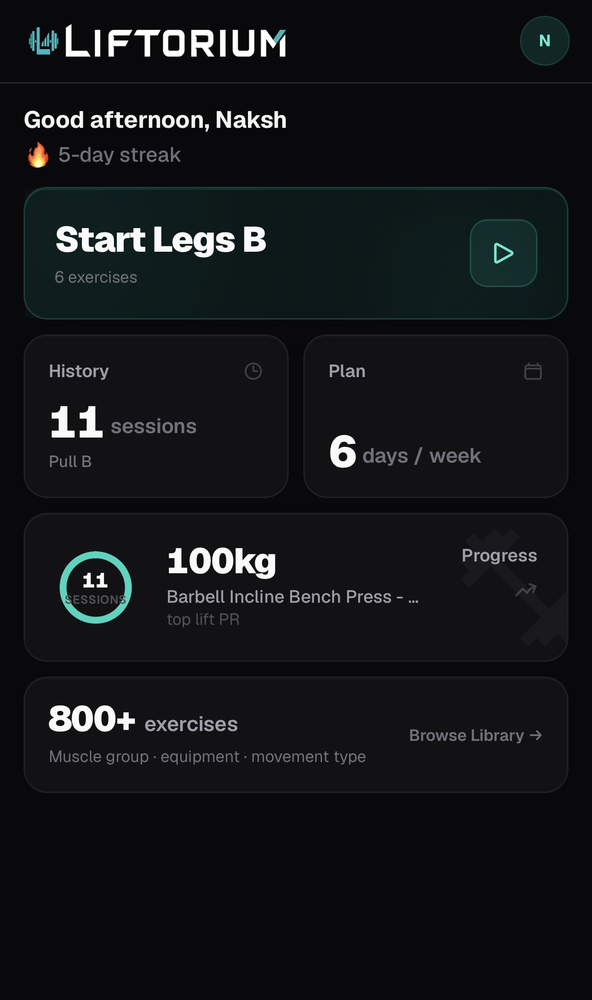
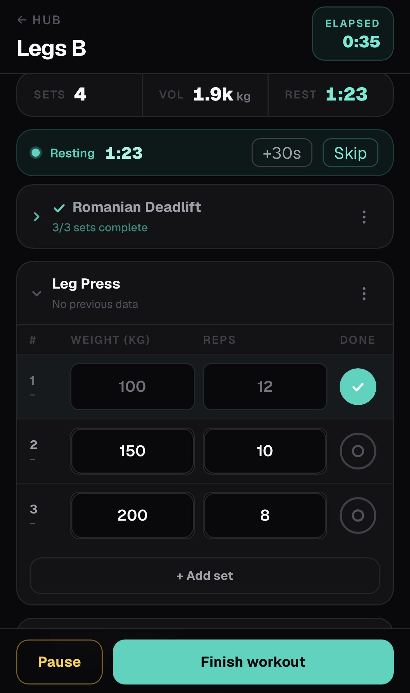
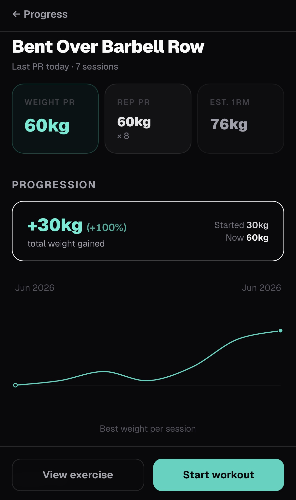
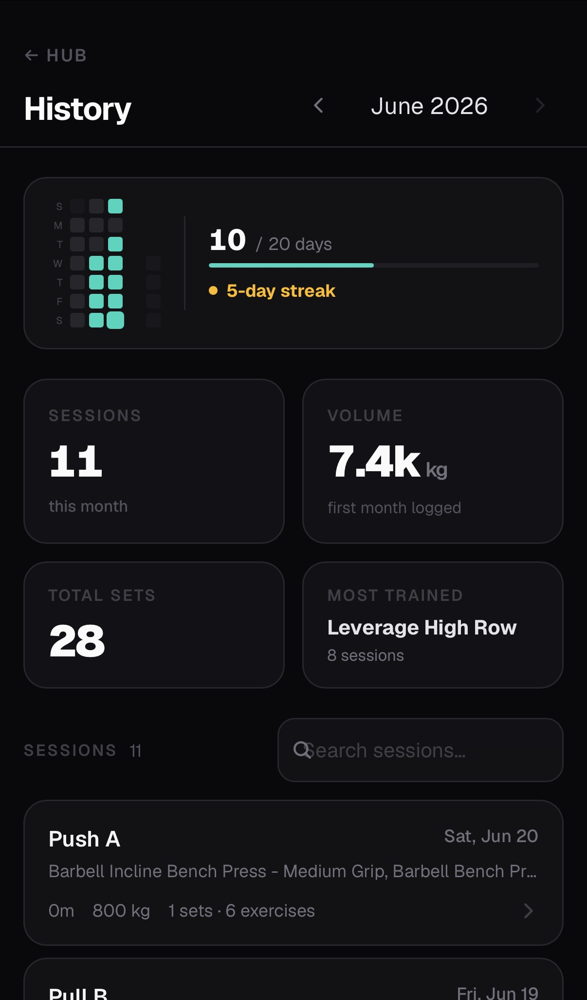
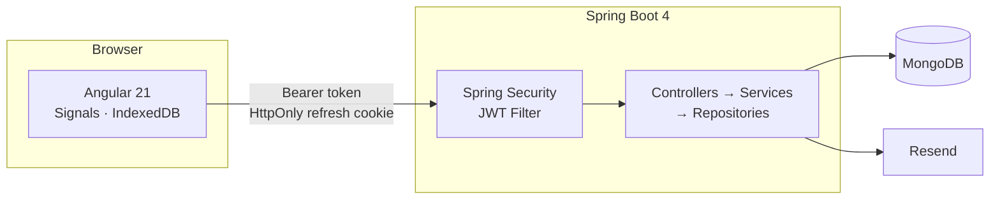

# Liftorium

A workout tracking application built for real gym usage — fast, focused, and mobile-first.

---

## Product Overview

Liftorium is a full-stack workout tracker built around one constraint: it has to be usable mid-set, with one hand, under a barbell.

Most tracking apps optimise for data completeness over speed. Liftorium inverts that priority. The workflow minimises taps during a live session — logging a set should take seconds, not a navigation sequence. The exercise catalog is cached locally and the live workout page never makes backend calls during an active set, so logging stays responsive even in poor gym connectivity.

Beyond live logging, Liftorium tracks progression automatically. When a workout is finished, the backend runs a PR evaluation engine that compares each exercise against your all-time bests and records personal records without any manual input.

---

## Why Liftorium?

| Problem | Liftorium's approach |
|---|---|
| Other apps require login before you can log anything | Guest mode — start tracking immediately, sync after signup |
| Logging a set mid-workout requires too many taps | Signal-based live state, no round-trips during active sets |
| Progress tracking requires manual note-keeping | Automatic PR detection on every finished workout |
| Apps break in poor gym connectivity | Exercise catalog and workout plans cached locally; live set logging has no backend dependency |
| One-size-fits-all set tracking | Four tracking types: weight/reps, reps-only, duration, cardio |

---

## Technical Highlights

These engineering decisions distinguish Liftorium from a standard CRUD application:

- **Local-first workout state** — `LiveWorkoutStore` manages the entire in-progress session in memory using Angular Signals. No backend calls occur during active set logging. State is persisted to IndexedDB between page loads.
- **Guest-to-account sync** — unauthenticated users can log complete workouts. On login, a sync modal previews pending local workouts and bulk-uploads them via a single API call. Idempotency is enforced by `clientId`.
- **Automatic PR evaluation engine** — `ProgressEvaluationService` runs once per finished workout. It reduces all sets to a session-best record (Phase 1) then compares against all-time bests (Phase 2), emitting typed `PrEvent` documents with previous and new values. Four tracking types are handled independently.
- **Versioned exercise catalog cache** — the backend computes a SHA-1 catalog version from active exercise count and latest update time. The Angular `APP_INITIALIZER` hydrates from IndexedDB instantly on returning visits and re-downloads only when the version changes.
- **Workout plan localStorage cache** — `PlanStore` reads from localStorage synchronously at construction, so the plan page renders without a network round-trip. The server response overwrites the local copy if available.
- **Dual-token JWT with hash-stored refresh tokens** — refresh tokens are never stored raw. The server persists an HMAC-SHA256 hash keyed with a separate secret. Tokens are rotated on every use; the `tokenId` claim is cross-checked against the persisted record to prevent substitution attacks.

---

## Current Status

**The MVP is feature-complete.** All core capabilities are implemented across both backend and frontend.

### Implemented

- Authentication — OTP email verification, login, forgot password, JWT session management
- Exercise catalog — browsable, searchable, filterable UI with detail pages and tracking types
- Live workout logging — Signal-based, locally persisted; no backend calls during active set logging
- Workout plans — multi-day planner with drag reorder, exercise picker, and plan templates
- Workout history — monthly view with consistency heatmap, stats, search, and per-workout detail
- Progress tracking — PR detection engine, exercise progression charts, PR event timeline
- Guest workout persistence — full workout logging before signup, sync modal on login
- User settings — units, rest timer, theme, display name, password change, account deletion

### Current Focus

- Expanding automated test coverage — Vitest is configured and initial tests exist
- Backend test setup — no backend tests implemented yet

### Future Enhancements

- DURATION and DISTANCE PR types in the progress frontend — backend detection and storage is complete; the progression chart and PR timeline filter do not yet visualise these types
- Workout volume analytics with muscle group breakdown
- Social or coach-facing features

See the [Open Tasks](./docs/progress/open-tasks.md) for the full active task list.

---

## Features

### Authentication

- Email registration with OTP email verification
- Email and password login
- Forgot password with OTP-verified reset
- JWT dual-token sessions: short-lived access token, long-lived refresh token
- Automatic token refresh — a failed request retries transparently after a token refresh
- Secure logout

### Exercise Management

- Publicly accessible exercise catalog — no login required
- Full browsing UI with live search, filter sheet (muscle group, equipment, exercise type, level, mechanic, force), active filter chips, and load-more pagination
- Exercise detail pages — muscles, equipment, instructions, add-to-workout and start-workout actions
- Four tracking types per exercise: weight and reps, reps only, duration, cardio
- Exercise catalog cached in IndexedDB — version-gated re-download; list browsing stays responsive without a live connection; detail pages require backend connectivity

### Workout Tracking

- Start, pause, resume, and finish workout sessions
- Add, remove, reorder, and replace exercises during a live session
- Per-tracking-type set logging: weight, reps, duration, distance, speed, incline
- Automatic rest timer after each completed set
- Guest mode: full workout logging without an account; workouts persisted locally until synced
- Sync modal on login — previews pending offline workouts before uploading
- Multi-day workout plans — create a plan with drag reorder and built-in templates, start a session directly from a plan day

### Workout History

- Monthly history browser with month navigation
- Consistency heatmap — visual calendar of training days
- Stats cards: sessions, total volume, total sets, training streak, month-over-month volume delta
- Per-workout detail page — all exercises and sets with volume breakdown
- Best-workout badge for the highest-volume session in a month

### Progress Tracking

- Automatic PR detection on every finished workout — no manual input required
- PR types: max weight, best rep set, estimated one-rep max (Epley formula), longest duration, longest distance
- Per-exercise progression chart — interactive SVG with Catmull-Rom smoothing, pointer tooltip, "Started → Now" weight summary
- PR event timeline — filterable by PR type with previous → new value transitions (e.g. "35 kg → 47.5 kg")
- Progress overview — total PRs recorded, exercises improved, strongest exercise, latest PR date
- All progress data visible on both the progress page and the dashboard

### Platform

- Weight and distance unit selection (kg / lb, km / mi)
- Configurable default rest time and auto-start rest timer
- Dark theme by default
- Mobile-first responsive layout
- Account management — update display name, change password with current-password verification, delete account

---

## Screenshots

| | |
|---|---|
| **Dashboard** | **Workout Session** |
|  |  |
| **Progress** | **Workout History** |
|  |  |

---

## Tech Stack

| Layer | Technology |
|---|---|
| Frontend | Angular 21, standalone components, lazy-loaded routes |
| State management | Angular Signals |
| Styling | TailwindCSS 4, mobile-first, dark theme |
| Local storage | IndexedDB via `idb` (exercise catalog, guest workouts), localStorage (plan, settings cache) |
| Backend | Spring Boot 4, Java 21, Maven |
| Database | MongoDB, Spring Data, TTL indexes |
| Authentication | JWT — JJWT 0.12.6, stateless, dual-token |
| Email | Resend API |
| Password hashing | BCrypt |

---

## Architecture

Liftorium is a monorepo: an Angular 21 SPA and a Spring Boot 4 REST API, backed by MongoDB.



The backend uses strict controller → service → repository layering. The frontend manages all live workout state in memory via Angular Signals, with IndexedDB persistence — no backend calls occur during an active set.

> Detailed architecture documentation is available in [docs/architecture](./docs/architecture/).

---

## Security

- **JWT authentication** — stateless, verified on every request
- **Dual-token model** — short-lived access token (15 min) + long-lived refresh token (30 days)
- **HttpOnly refresh cookie** — refresh token is never accessible to JavaScript; `SameSite=Strict` enforced
- **Refresh token rotation** — every use issues a new token and revokes the old one
- **Tokens stored as hashes** — refresh tokens are persisted as HMAC-SHA256 hashes, never raw
- **BCrypt password hashing** — configurable cost factor
- **OTP verification** — 6-digit codes hashed with BCrypt, TTL-expired, rate-limited (3 attempts per 10 min)
- **Enumeration protection** — forgot-password always returns success regardless of whether the email exists
- **Input validation** — Jakarta Bean Validation on all request bodies

See [Security Architecture](./docs/architecture/security.md) and [JWT Refresh Token Strategy](./docs/decisions/0002-jwt-refresh-token-strategy.md) for full detail.

---

## Database

MongoDB with 11 collections. Three use TTL indexes for automatic document expiry.

| Collection | Description |
|---|---|
| `users` | Accounts |
| `refresh_tokens` | Active refresh token hashes — TTL indexed |
| `pending_registrations` | In-progress OTP registrations — TTL indexed |
| `password_reset_requests` | In-progress password resets — TTL indexed |
| `exercises` | Exercise catalog |
| `workouts` | Sessions with embedded exercises and sets |
| `workout_plans` | Multi-day training plan templates |
| `exercise_progress` | All-time PR values per user per exercise |
| `exercise_progress_history` | One snapshot per exercise per finished workout |
| `pr_events` | Individual PR records with previous and new values |
| `user_settings` | Per-user preferences |

See [Backend Component Diagram](./docs/architecture/backend-components.md) for full schema and index detail.

---

## API

Base path: `/api/v1`

All endpoints return a consistent envelope:

```json
{ "success": true, "data": { ... } }
{ "success": false, "error": { "code": "...", "message": "..." } }
```

| Area | Path | Auth |
|---|---|---|
| Auth | `/auth/**` | Public / Cookie / JWT |
| Exercises | `/exercises` — list, search, catalog-version, detail | Public |
| Workouts | `/workouts` — start, active, history, stats, detail, finish | JWT |
| Workout sync | `/workouts/sync` — bulk guest upload | JWT |
| Workout plan | `/plan` — get, upsert; `/plan/templates` — template list | JWT |
| Progress | `/progress/overview`, `/progress/exercises`, `/progress/prs` | JWT |
| History | `/history/insights` | JWT |
| Settings | `/settings` — get, update; `/settings/account`; `/settings/security/password` | JWT |

See [API Documentation](./docs/api/README.md) for full endpoint reference and request/response contracts.

---

## Testing

The frontend test suite uses **Vitest** with **fast-check** for property-based testing.

Current coverage includes:

- `LiveWorkoutStore` — state transitions, pause/resume, set mutations
- `GuestWorkoutStorageService` — IndexedDB and localStorage paths, stale detection
- `WorkoutSyncService` — sync payload construction, property tests on edge cases
- `authGuard` — route protection logic
- Core component smoke tests (`NavBar`, `AuthGateModal`, app shell)

Run the frontend tests:

```bash
cd frontend
npm test
```

Backend tests are not yet implemented. Tracking in [Open Tasks](./docs/progress/open-tasks.md).

---

## Repository Structure

```text
gym/
├── backend/          Java 21 · Spring Boot 4 · Maven
├── frontend/         Angular 21 · TypeScript · TailwindCSS 4
└── docs/
    ├── architecture/ System design, component diagrams, architecture review
    ├── api/          REST API contracts
    ├── decisions/    Architecture decision records
    └── progress/     Roadmap, progress log, open tasks
```

---

## Backend Setup

**Prerequisites:** Java 21, Maven, MongoDB

```bash
cd backend
mvn spring-boot:run
```

**Required environment variables:**

| Variable | Description | Default |
|---|---|---|
| `MONGODB_URI` | MongoDB connection string | — |
| `JWT_ACCESS_SECRET` | Signing key for access tokens | — |
| `JWT_REFRESH_SECRET` | Signing key and hash salt for refresh tokens | — |
| `RESEND_API_KEY` | Resend email API key | — |
| `RESEND_FROM_EMAIL` | Sender address | — |
| `CORS_ORIGINS` | Allowed frontend origin | `http://localhost:4200` |
| `ACCESS_TOKEN_TTL` | Access token lifetime | `15m` |
| `REFRESH_TOKEN_TTL` | Refresh token lifetime | `30d` |
| `BCRYPT_STRENGTH` | BCrypt cost factor | `10` |
| `PORT` | Server port | `4000` |
| `EXERCISE_SYNC_ON_STARTUP` | Sync exercise catalog from the bundled provider on boot | `false` |

Configuration: `backend/src/main/resources/application.properties`

Build and run the jar:

```bash
cd backend
mvn clean package
java -jar target/liftorium-backend-0.1.0.jar
```

---

## Frontend Setup

**Prerequisites:** Node.js

```bash
cd frontend
npm install
npm start
```

| Script | Description |
|---|---|
| `npm start` | Development server at `http://localhost:4200` |
| `npm run build` | Production build |
| `npm test` | Unit tests |

---

## Documentation

| Area | Description |
|---|---|
| [Project Docs](./docs/README.md) | Documentation index |

### Architecture

| Document | Description |
|---|---|
| [System Architecture](./docs/architecture/system-architecture.md) | Full component diagram — all services, security, and MongoDB collections |
| [Authentication Flow](./docs/architecture/auth-flow.md) | Sequence diagrams for registration, login, token refresh, password reset, and logout |
| [Backend Component Diagram](./docs/architecture/backend-components.md) | All packages, classes, relationships, and request lifecycle |
| [Architecture Review](./docs/architecture/architecture-review.md) | Strengths, risks, scalability concerns, and refactor recommendations |

### API

| Document | Description |
|---|---|
| [Auth API](./docs/api/auth.md) | Registration, login, token refresh, logout |
| [Exercises API](./docs/api/exercises.md) | Catalog, search, filters |
| [Workouts API](./docs/api/workouts.md) | Session management, set logging |
| [Progress API](./docs/api/progress.md) | PR events, exercise history |
| [Settings API](./docs/api/settings.md) | User preferences |
| [API Conventions](./docs/api/conventions.md) | Response envelope, errors, pagination |

### Design Decisions

| Document | Decision |
|---|---|
| [0002 JWT Refresh Token Strategy](./docs/decisions/0002-jwt-refresh-token-strategy.md) | Dual-token model, cookie storage, hash persistence, rotation |
| [0005 Angular Auth Flow](./docs/decisions/0005-angular-auth-flow-design.md) | Signals auth state, interceptors, guards, token storage |
| [0006 Live Workout UI State](./docs/decisions/0006-live-workout-ui-state.md) | In-memory Signals state, IndexedDB persistence, offline model |
| [0009 Resend Email](./docs/decisions/0009-resend-transactional-email.md) | OTP email delivery via Resend API |
| [All decisions →](./docs/decisions/README.md) | |

### Progress

| Document | Description |
|---|---|
| [Progress Log](./docs/progress/progress-log.md) | Dated implementation entries |
| [Open Tasks](./docs/progress/open-tasks.md) | Current and upcoming work |
| [MVP Roadmap](./docs/progress/mvp-roadmap.md) | Milestone status |

---

## Author

Nakshatra Jain

---

## License

This project is not currently licensed for external distribution.
