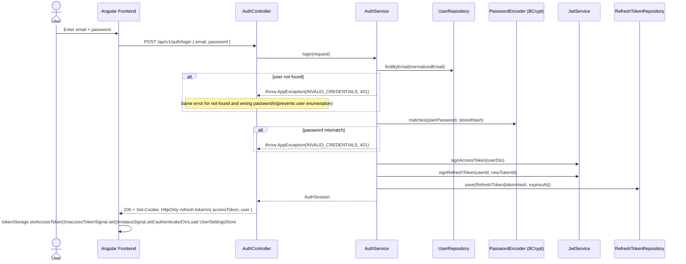
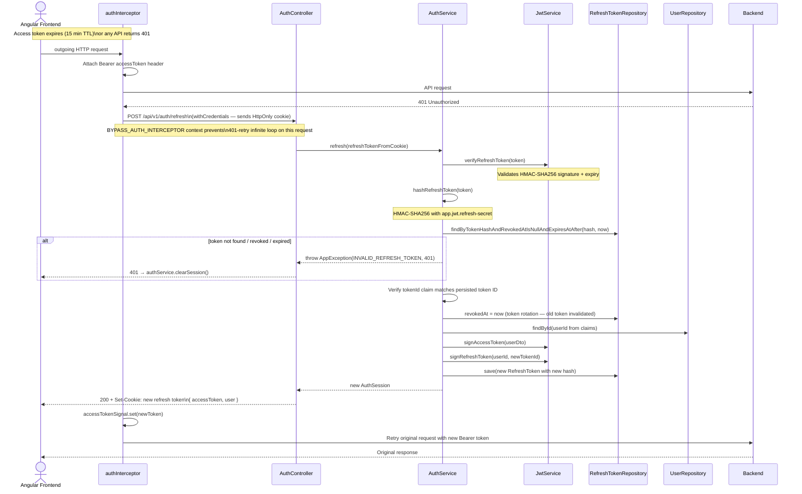
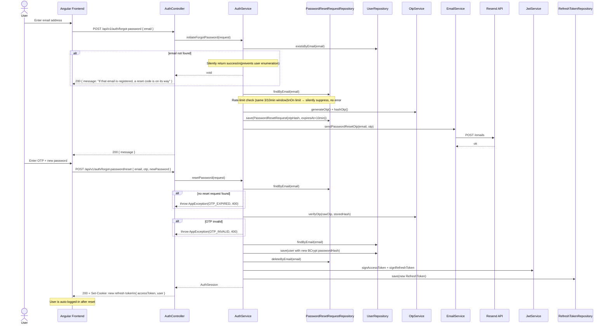

# Authentication Flow

> Generated from source code analysis of `AuthController`, `AuthService`, `JwtService`, `OtpService`, `EmailService`, and the Angular `AuthService` + `authInterceptor`.

---

## 1. Registration Flow (OTP-verified)

```mermaid
sequenceDiagram
    actor User
    participant FE as Angular Frontend
    participant AC as AuthController
    participant AS as AuthService
    participant PR as PendingRegistrationRepository
    participant OTP as OtpService
    participant ES as EmailService
    participant Resend as Resend API
    participant UR as UserRepository
    participant SR as UserSettingsRepository
    participant JWS as JwtService
    participant RT as RefreshTokenRepository

    User->>FE: Enter email, displayName, password
    FE->>AC: POST /api/v1/auth/register/initiate
    AC->>AS: initiateRegistration(request)

    AS->>UR: existsByEmail(email)
    alt email already registered
        AS-->>AC: throw AppException(EMAIL_ALREADY_REGISTERED, 409)
        AC-->>FE: 409 Conflict
    end

    AS->>PR: findByEmail(email)
    Note over AS,PR: Rate-limit check: ≥3 attempts in 10 min window → 429

    AS->>OTP: generateOtp()
    Note over OTP: SecureRandom.nextInt(100_000, 1_000_000)
    OTP-->>AS: 6-digit OTP (plaintext)

    AS->>OTP: hashOtp(otp)
    Note over OTP: BCrypt encode
    OTP-->>AS: bcrypt hash

    AS->>PR: save(PendingRegistration)\n(email, displayName, passwordHash, otpHash, expiresAt+10min)
    AS->>ES: sendOtp(email, otp)
    ES->>Resend: POST /emails (Bearer RESEND_API_KEY)
    Resend-->>ES: { id: "resend-msg-id" }
    ES-->>AS: ok
    AS-->>AC: void
    AC-->>FE: 200 { message: "Verification code sent to your email" }

    User->>FE: Enter 6-digit OTP from email
    FE->>AC: POST /api/v1/auth/register/verify { email, otp }
    AC->>AS: verifyRegistration(request)

    AS->>PR: findByEmail(email)
    alt no pending registration found
        AS-->>AC: throw AppException(OTP_EXPIRED, 400)
    end

    AS->>OTP: verifyOtp(rawOtp, storedHash)
    Note over OTP: BCrypt.matches()
    alt OTP invalid
        AS-->>AC: throw AppException(OTP_INVALID, 400)
    end

    AS->>UR: existsByEmail(email)
    alt race condition — already registered
        AS->>PR: deleteByEmail(email)
        AS-->>AC: throw AppException(EMAIL_ALREADY_REGISTERED, 409)
    end

    AS->>UR: save(User{email, displayName, passwordHash})
    AS->>SR: save(UserSettings.createDefaults(userId))
    AS->>PR: deleteByEmail(email)

    AS->>JWS: signAccessToken(userDto)
    Note over JWS: HMAC-SHA256, TTL=15m
    AS->>JWS: signRefreshToken(userId, tokenId)
    Note over JWS: HMAC-SHA256, TTL=30d
    AS->>RT: save(RefreshToken{id, userId, tokenHash, expiresAt})
    Note over AS,RT: Stored as HMAC-SHA256 hash of raw token

    AS-->>AC: AuthSession(user, accessToken, refreshToken)
    AC-->>FE: 201 + Set-Cookie: liftorium_refresh_token=<JWT>; HttpOnly; SameSite=Strict\n{ accessToken, user }

    FE->>FE: Store accessToken in localStorage\nSet Signals: user, status=authenticated\nLazy-load UserSettingsStore
```

---

## 2. Login Flow



---

## 3. Token Refresh Flow



---

## 4. Forgot Password / Reset Flow



---

## 5. Logout Flow

```mermaid
sequenceDiagram
    actor User
    participant FE as Angular Frontend
    participant AS_FE as AuthService (Angular)
    participant AC as AuthController
    participant AS as AuthService (Spring)
    participant RT as RefreshTokenRepository

    User->>FE: Tap logout
    FE->>AS_FE: logout()
    AS_FE->>AC: POST /api/v1/auth/logout\n(withCredentials, manual Bearer token header\nBYPASS_AUTH_INTERCEPTOR context)

    AC->>AS: logout(refreshTokenFromCookie)
    AS->>AS: hashRefreshToken(token)
    AS->>RT: findByTokenHashAndRevokedAtIsNullAndExpiresAtAfter(hash, now)
    AS->>RT: revokedAt = now (revoke token)

    AC-->>FE: 200 + Set-Cookie: liftorium_refresh_token=; Max-Age=0\n{ loggedOut: true }

    AS_FE->>AS_FE: clearSession()
    Note over AS_FE: tokenStorage.clearAccessToken()\ntokenStorage.setLoggedOut() ← prevents silent refresh\naccessTokenSignal = null\nuserSignal = null\nstatusSignal = 'anonymous'\nUserSettingsStore.clear()
```

---

## Token Specification Summary

| Property | Access Token | Refresh Token |
|---|---|---|
| Algorithm | HMAC-SHA256 (JJWT) | HMAC-SHA256 (JJWT) |
| Signing key | `JWT_ACCESS_SECRET` | `JWT_REFRESH_SECRET` |
| Default TTL | 15 minutes | 30 days |
| Transport | `Authorization: Bearer` header | `HttpOnly; SameSite=Strict` cookie |
| Storage (client) | `localStorage` | Browser cookie (never JS-accessible) |
| Storage (server) | Stateless — not persisted | HMAC-SHA256 hash stored in MongoDB |
| Rotation | — | Rotated on every successful refresh |
| Revocation | Not revocable (short TTL) | `revokedAt` timestamp in MongoDB |
| Logout guard | `tokenStorage.isLoggedOut()` flag | Cookie cleared with `Max-Age=0` |
