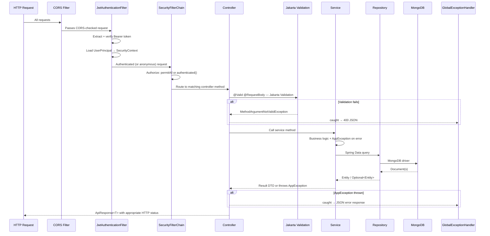

# Backend Component Diagram

> Generated from source code analysis. Package structure is `com.liftorium.*`.
> All classes shown exist in the codebase.

---

## Package Structure & Component Relationships

```mermaid
graph TB
    subgraph entrypoint["Entry Point"]
        App["LiftoriumApplication\n@SpringBootApplication"]
    end

    subgraph config["config"]
        AppProps["AppProperties\n@ConfigurationProperties\n(app.*)\n─────────────────\njwt: secret, ttl, cookieName\nemail: resendApiKey, from\notp: expiryMinutes, maxAttempts\nsecurity: bcryptStrength\ncors: allowedOrigins"]
        SecConfig["security/SecurityConfig\n@Configuration\n─────────────────\nSecurityFilterChain\nPasswordEncoder (BCrypt)\nAuthenticationManager"]
        CorsConfig["CorsConfig\n(via SecurityConfig.cors)"]
        JwtKeyConfig["JwtKeyConfig\n─────────────────\n@Bean accessTokenSigningKey\n@Bean refreshTokenSigningKey\n(HMAC-SHA256 SecretKey)"]
    end

    subgraph security["security"]
        JwtFilter["JwtAuthenticationFilter\nOncePerRequestFilter\n─────────────────\nExtracts Bearer token\nValidates via JwtService\nLoads UserPrincipal\nSets SecurityContext"]
        UDS["CustomUserDetailsService\nUserDetailsService\n─────────────────\nloadUserByUsername(email)\n→ UserPrincipal"]
        UP["UserPrincipal\nUserDetails\n─────────────────\nid, email, displayName\ngetAuthorities() → []"]
        EntryPt["RestAuthenticationEntryPoint\nAuthenticationEntryPoint\n─────────────────\nReturns JSON 401\n(no redirect)"]
    end

    subgraph controller["controller"]
        AuthCtrl["AuthController\n/api/v1/auth\n─────────────────\nPOST /register/initiate\nPOST /register/verify\nPOST /register\nPOST /login\nPOST /refresh\nGET  /me\nPOST /forgot-password\nPOST /forgot-password/reset\nPOST /logout"]
        WorkoutCtrl["WorkoutController\n/api/v1/workouts\n─────────────────\nGET    / (paginated)\nPOST   /\nGET    /:id\nPUT    /:id\nDELETE /:id\nPOST   /finish"]
        ExCtrl["ExerciseController\n/api/v1/exercises\n─────────────────\nGET / (public, filtered)\nGET /:id (public)"]
        PlanCtrl["WorkoutPlanController\n/api/v1/workout-plans\n─────────────────\nFull CRUD"]
        ProgressCtrl["ProgressController\n/api/v1/progress\n─────────────────\nGET /exercises\nGET /exercises/:id\nGET /prs"]
        HistoryCtrl["HistoryInsightsController\n/api/v1/history\n─────────────────\nGET /insights\nGET /workouts"]
        SettingsCtrl["UserSettingsController\n/api/v1/settings\n─────────────────\nGET  /\nPATCH /"]
        SyncCtrl["SyncController\n/api/v1/sync\n─────────────────\nPOST /workouts (bulk)"]
        AdminCtrl["AdminExerciseController\n/api/v1/admin/exercises\n─────────────────\nPOST / (create)\nPUT /:id (update)"]
        HealthCtrl["HealthController\nGET /health (public)"]
    end

    subgraph dto["dto"]
        ApiResp["ApiResponse<T>\n─────────────────\nsuccess(data)\nerror(code, message)"]
        AuthDtos["AuthDtos\n─────────────────\nRegisterInitiateRequest\nRegisterVerifyRequest\nRegisterRequest\nLoginRequest\nForgotPasswordRequest\nResetPasswordRequest\nAuthUserDto\nAuthSession\nsessionData()"]
        WorkoutDtos["WorkoutDtos\n─────────────────\nCreateWorkoutRequest\nUpdateWorkoutRequest\nFinishWorkoutRequest\nWorkoutResponse"]
        ExerciseDtos["ExerciseDtos\n─────────────────\nExerciseResponse\nExerciseFilters\nExercisePageResponse"]
        PlanDtos["WorkoutPlanDtos"]
        ProgressDtos["ProgressDtos\n─────────────────\nExerciseProgressResponse\nPrEventResponse"]
        SettingsDtos["UserSettingsDtos\n─────────────────\nUserSettingsResponse\nUpdateSettingsRequest"]
        SyncDtos["SyncDtos\n─────────────────\nSyncWorkoutsRequest\nSyncWorkoutsResponse"]
    end

    subgraph service["service"]
        AuthSvc["AuthService\n─────────────────\ninitiateRegistration()\nverifyRegistration()\nregister()\nlogin()\nrefresh()\ninitiateForgotPassword()\nresetPassword()\nlogout()\ncreatSession() → AuthSession\nhashRefreshToken() (HMAC-SHA256)"]
        JwtSvc["JwtService\n─────────────────\nsignAccessToken()\nsignRefreshToken()\nverifyAccessToken()\nverifyRefreshToken()\ngetAccessTokenEmail()\ngetRefreshTokenTtl()"]
        OtpSvc["OtpService\n─────────────────\ngenerateOtp() (SecureRandom)\nhashOtp() (BCrypt)\nverifyOtp() (BCrypt.matches)"]
        EmailSvc["EmailService\n─────────────────\nsendOtp()\nsendPasswordResetOtp()\nsendEmail() (RestClient)\n── records ──\nResendEmailRequest\nResendEmailResponse"]
        WorkoutSvc["WorkoutService\n─────────────────\ncreateWorkout()\ngetWorkouts()\ngetWorkout()\nupdateWorkout()\ndeleteWorkout()\nfinishWorkout() → triggers PR eval"]
        ExerciseSvc["ExerciseService\n─────────────────\ngetExercises() (filtered/paged)\ngetExercise()\ncreateExercise()\nupdateExercise()"]
        PlanSvc["WorkoutPlanService\n─────────────────\nFull CRUD for WorkoutPlan"]
        ProgressSvc["ProgressService\n─────────────────\ngetExerciseProgress()\ngetExerciseProgressDetail()\ngetPrEvents()"]
        ProgEvalSvc["ProgressEvaluationService\n─────────────────\nevaluate(workout)\nbuildSessionRecord() — Phase 1\nevaluateSession()   — Phase 2\nevaluateWeightPr()\nevaluateRepPr()\nevaluateE1rmPr() (Epley formula)\nevaluateDurationPr()\nevaluateDistancePr()"]
        SyncSvc["WorkoutSyncService\n─────────────────\nsyncWorkouts() (bulk upsert)\nconvertGuestWorkout()"]
        StatsSvc["WorkoutStatsService\n─────────────────\ngetStats(userId)\n(aggregates volume, frequency)"]
        HistorySvc["HistoryInsightsService\n─────────────────\ngetInsights()\ngetWorkoutHistory()"]
        SettingsSvc["UserSettingsService\n─────────────────\ngetSettings()\nupdateSettings()"]
        CatalogSvc["CatalogVersionService\n─────────────────\ngetCurrentVersion()\nbumpVersion()"]
        ExSyncSvc["ExerciseSyncService\n─────────────────\nsyncExercises() (startup)"]
    end

    subgraph repository["repository"]
        UserRepo["UserRepository\nMongoRepository<User, String>\n─────────────────\nfindByEmail()\nexistsByEmail()"]
        RefreshRepo["RefreshTokenRepository\nMongoRepository<RefreshToken, String>\n─────────────────\nfindByTokenHashAndRevokedAtIsNull\nAndExpiresAtAfter()"]
        PendingRepo["PendingRegistrationRepository\nMongoRepository<PendingRegistration, String>\n─────────────────\nfindByEmail()\ndeleteByEmail()"]
        PwdResetRepo["PasswordResetRequestRepository\nMongoRepository<PasswordResetRequest, String>\n─────────────────\nfindByEmail()\ndeleteByEmail()"]
        WorkoutRepo["WorkoutRepository\nMongoRepository<Workout, String>\n─────────────────\nfindByUserIdOrderByStartedAtDesc()\nfindByUserIdAndId()"]
        ExRepo["ExerciseRepository\nMongoRepository<Exercise, String>"]
        ExQueryRepo["ExerciseQueryRepository\n(custom impl)\n─────────────────\nfindFiltered() (dynamic query\nwith text search, muscle, equipment\npagination)"]
        PlanRepo["WorkoutPlanRepository\nMongoRepository<WorkoutPlan, String>\n─────────────────\nfindByUserId()"]
        ProgressRepo["ExerciseProgressRepository\nMongoRepository<ExerciseProgress, String>\n─────────────────\nfindByUserId()\nfindByUserIdAndExerciseId()"]
        HistoryRepo["ExerciseProgressHistoryRepository\nMongoRepository<ExerciseProgressHistory, String>\n─────────────────\nexistsByUserIdAndExerciseIdAndWorkoutId()\nfindByUserIdAndExerciseId()"]
        PrEventRepo["PrEventRepository\nMongoRepository<PrEvent, String>\n─────────────────\nfindByUserIdAndExerciseId()\nfindByUserId()"]
        SettingsRepo["UserSettingsRepository\nMongoRepository<UserSettings, String>\n─────────────────\nfindByUserId()"]
    end

    subgraph entity["entity"]
        UserE["User @Document\n─────────────────\nid, email, displayName\npasswordHash\ncreatedAt, updatedAt"]
        RefreshTokenE["RefreshToken @Document\n─────────────────\nid, userId, tokenHash\nexpiresAt, revokedAt\n[TTL index on expiresAt]"]
        PendingRegE["PendingRegistration @Document\n─────────────────\nemail, displayName, passwordHash\notpHash, expiresAt\nattemptCount, lastAttemptAt\n[TTL index on expiresAt]"]
        PwdResetE["PasswordResetRequest @Document\n─────────────────\nemail, otpHash, expiresAt\nattemptCount, lastAttemptAt\n[TTL index on expiresAt]"]
        WorkoutE["Workout @Document\n─────────────────\nuserId, name, status\nstartedAt, finishedAt\nexercises: List<WorkoutExercise>"]
        WorkoutExE["WorkoutExercise @Field\n─────────────────\nexerciseId, name, order\nsets: List<WorkoutSet>"]
        WorkoutSetE["WorkoutSet @Field\n─────────────────\norder, reps, weight\ndurationSeconds, distanceKm\nspeed, incline\ncompletedAt, setType, tempo"]
        ExerciseE["Exercise @Document\n─────────────────\nname, target, equipment\nexerciseType, trackingType\nproviderType, sourceInfo\ncatalogVersion"]
        WorkoutPlanE["WorkoutPlan @Document\n─────────────────\nuserId, name, description\ndays: List<PlanDay>"]
        PlanDayE["PlanDay @Field\n─────────────────\nlabel\nexercises: List<PlanExercise>"]
        PlanExE["PlanExercise @Field\n─────────────────\nexerciseId, exerciseName\nsets: List<PlanSet>"]
        ExProgressE["ExerciseProgress @Document\n─────────────────\nuserId, exerciseId\nweightPr, repPrReps/Weight\nestimatedOneRepMaxPr\nlongestDurationSeconds\nlongestDistanceKm\ntotalPrs, lastImprovedAt"]
        ExProgressHistE["ExerciseProgressHistory @Document\n─────────────────\nuserId, exerciseId, workoutId\nperformedAt + all session metrics"]
        PrEventE["PrEvent @Document\n─────────────────\nuserId, exerciseId, workoutId\nprType, previousValue, newValue\nachievedAt"]
        UserSettingsE["UserSettings @Document\n─────────────────\nuserId\nunits: {weight, distance}\nworkout: {defaultRestSeconds, autoStartRestTimer}\nappearance: {theme}"]
        TrackingTypeE["TrackingType enum\n─────────────────\nWEIGHT_REPS\nREPS_ONLY\nDURATION\nCARDIO"]
        PrTypeE["PrType enum\n─────────────────\nWEIGHT\nREPS\nESTIMATED_ONE_REP_MAX\nDURATION\nDISTANCE"]
    end

    subgraph exception["exception"]
        AppEx["AppException\n─────────────────\ncode: String\nmessage: String\nhttpStatus: HttpStatus"]
        GlobalEH["GlobalExceptionHandler\n@RestControllerAdvice\n─────────────────\nhandleAppException()\nhandleValidationException()\nhandleMethodArgumentNotValid()\nhandleGeneric()"]
    end

    subgraph util["util"]
        DurParser["DurationParser\n─────────────────\nparse(String) → Duration\n(e.g. '15m', '30d')"]
    end

    subgraph validation["validation"]
        StrongPwd["@StrongPassword\nConstraintValidator\n─────────────────\nmin 8 chars\nupper + lower + digit"]
    end

    subgraph startup["startup"]
        ExSyncRunner["ExerciseSyncRunner\nApplicationRunner\n─────────────────\nRuns on startup if\nEXERCISE_SYNC_ON_STARTUP=true"]
    end

    subgraph provider["provider"]
        WgerProvider["WgerExerciseProvider\n─────────────────\nFetches exercises from\nexternal Wger API"]
    end

    subgraph cache["cache"]
        CatalogCache["CatalogVersionCache\n─────────────────\nIn-memory cache for\nexercise catalog version"]
    end

    %% Config wiring
    App --> config
    SecConfig --> JwtFilter
    SecConfig --> EntryPt
    JwtKeyConfig --> JwtSvc
    AppProps --> AuthSvc
    AppProps --> JwtSvc
    AppProps --> EmailSvc
    AppProps --> OtpSvc

    %% Security wiring
    JwtFilter --> JwtSvc
    JwtFilter --> UDS
    UDS --> UserRepo
    UDS --> UP

    %% Controller → DTO → Service
    AuthCtrl --> AuthDtos
    AuthCtrl --> AuthSvc
    WorkoutCtrl --> WorkoutDtos
    WorkoutCtrl --> WorkoutSvc
    ExCtrl --> ExerciseDtos
    ExCtrl --> ExerciseSvc
    PlanCtrl --> PlanDtos
    PlanCtrl --> PlanSvc
    ProgressCtrl --> ProgressDtos
    ProgressCtrl --> ProgressSvc
    HistoryCtrl --> HistorySvc
    SettingsCtrl --> SettingsDtos
    SettingsCtrl --> SettingsSvc
    SyncCtrl --> SyncDtos
    SyncCtrl --> SyncSvc
    AdminCtrl --> ExerciseSvc

    %% All controllers use ApiResponse
    AuthCtrl --> ApiResp
    WorkoutCtrl --> ApiResp
    ExCtrl --> ApiResp
    PlanCtrl --> ApiResp
    ProgressCtrl --> ApiResp
    HistoryCtrl --> ApiResp
    SettingsCtrl --> ApiResp
    SyncCtrl --> ApiResp

    %% Service wiring
    AuthSvc --> JwtSvc
    AuthSvc --> OtpSvc
    AuthSvc --> EmailSvc
    WorkoutSvc --> ProgEvalSvc
    SyncSvc --> WorkoutSvc
    SyncSvc --> ProgressSvc
    ProgEvalSvc --> TrackingTypeE
    ProgEvalSvc --> PrTypeE

    %% Service → Repository
    AuthSvc --> UserRepo
    AuthSvc --> RefreshRepo
    AuthSvc --> PendingRepo
    AuthSvc --> PwdResetRepo
    AuthSvc --> SettingsRepo
    WorkoutSvc --> WorkoutRepo
    ExerciseSvc --> ExRepo
    ExerciseSvc --> ExQueryRepo
    PlanSvc --> PlanRepo
    ProgressSvc --> ProgressRepo
    ProgressSvc --> PrEventRepo
    ProgEvalSvc --> ProgressRepo
    ProgEvalSvc --> PrEventRepo
    ProgEvalSvc --> HistoryRepo
    ProgEvalSvc --> ExRepo
    HistorySvc --> WorkoutRepo
    HistorySvc --> ProgressRepo
    StatsSvc --> WorkoutRepo
    SettingsSvc --> SettingsRepo
    CatalogSvc --> ExRepo
    ExSyncSvc --> ExRepo

    %% Repository → Entity
    UserRepo --- UserE
    RefreshRepo --- RefreshTokenE
    PendingRepo --- PendingRegE
    PwdResetRepo --- PwdResetE
    WorkoutRepo --- WorkoutE
    WorkoutE --- WorkoutExE
    WorkoutExE --- WorkoutSetE
    ExRepo --- ExerciseE
    ExQueryRepo --- ExerciseE
    PlanRepo --- WorkoutPlanE
    WorkoutPlanE --- PlanDayE
    PlanDayE --- PlanExE
    ProgressRepo --- ExProgressE
    HistoryRepo --- ExProgressHistE
    PrEventRepo --- PrEventE
    SettingsRepo --- UserSettingsE

    %% Exception flow
    GlobalEH -. catches .-> AppEx
    AppEx -. thrown by .-> AuthSvc
    AppEx -. thrown by .-> WorkoutSvc
    AppEx -. thrown by .-> JwtSvc
    AppEx -. thrown by .-> EmailSvc

    %% Util usage
    DurParser --- JwtSvc

    %% Validation
    StrongPwd -. validates .-> AuthDtos

    %% Startup
    ExSyncRunner --> ExSyncSvc
    ExSyncSvc --> WgerProvider
    ExSyncSvc --> CatalogSvc
    CatalogSvc --> CatalogCache

    style entrypoint fill:#1e293b,color:#e2e8f0
    style config fill:#1e3a5f,color:#e2e8f0
    style security fill:#1e1b4b,color:#e2e8f0
    style controller fill:#14532d,color:#e2e8f0
    style dto fill:#1a2e1a,color:#e2e8f0
    style service fill:#2d1b1b,color:#e2e8f0
    style repository fill:#2d2000,color:#e2e8f0
    style entity fill:#1a1a1a,color:#e2e8f0
    style exception fill:#3b1a1a,color:#e2e8f0
    style util fill:#1a1a3b,color:#e2e8f0
    style validation fill:#1a3b1a,color:#e2e8f0
    style startup fill:#2d2d00,color:#e2e8f0
    style provider fill:#2d1a2d,color:#e2e8f0
    style cache fill:#1a2d2d,color:#e2e8f0
```

---

## Package Summary Table

| Package | Classes | Responsibility |
|---|---|---|
| `config` | `AppProperties`, `SecurityConfig`, `JwtKeyConfig`, `CorsConfig` | Configuration beans, security filter chain, signing keys |
| `security` | `JwtAuthenticationFilter`, `CustomUserDetailsService`, `UserPrincipal`, `RestAuthenticationEntryPoint` | JWT extraction/validation, user identity, 401 responses |
| `controller` | 10 controllers | HTTP routing, request validation, response shaping |
| `dto` | `ApiResponse<T>`, auth/workout/exercise/plan/progress/settings/sync DTOs | Input validation, output contracts |
| `service` | 15 services | Business logic, orchestration |
| `repository` | 12 repositories | MongoDB data access via Spring Data |
| `entity` | 20 classes (documents, embedded, enums) | MongoDB document models |
| `entity/progress` | `ExerciseProgress`, `ExerciseProgressHistory`, `PrEvent`, `PrType` | PR tracking data model |
| `exception` | `AppException`, `GlobalExceptionHandler` | Centralized error handling |
| `util` | `DurationParser` | Parse human-readable durations to `java.time.Duration` |
| `validation` | `@StrongPassword` | Custom Jakarta constraint for password policy |
| `startup` | `ExerciseSyncRunner` | Optional exercise catalog sync from Wger on boot |
| `provider` | `WgerExerciseProvider` | External exercise data source adapter |
| `cache` | `CatalogVersionCache` | In-memory cache for exercise catalog version number |

---

## Request Lifecycle (HTTP → MongoDB)

