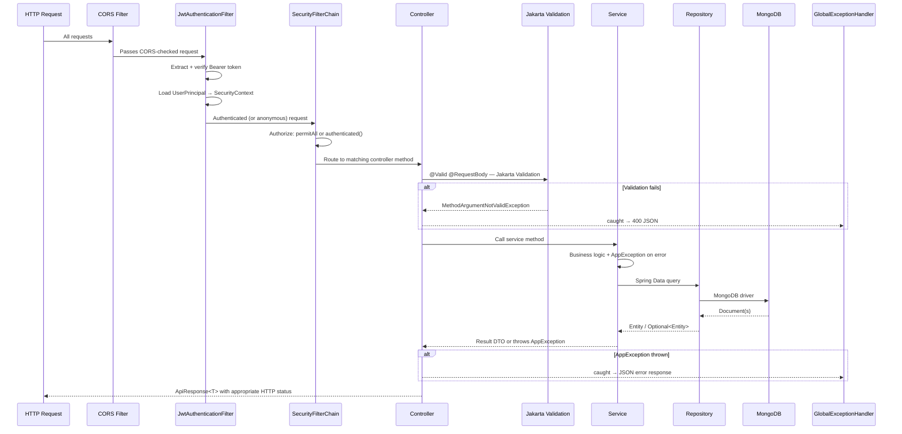

# Backend Component Diagram

> Generated from source code analysis. Every class and edge verified against actual source files.
> Package structure is `com.liftorium.*`.

---

## Package Structure & Component Relationships

```mermaid
graph TB
    subgraph entrypoint["Entry Point"]
        App["LiftoriumApplication\n@SpringBootApplication"]
    end

    subgraph config["config"]
        AppProps["AppProperties\n@ConfigurationProperties(app.*)\n─────────────────\njwt: secret, ttl, cookieName, cookiePath\nemail: resendApiKey, from\notp: expiryMinutes, maxAttempts, rateLimitWindowMinutes\nsecurity: bcryptStrength\ncors: allowedOrigins\nexercises: syncOnStartup"]
        SecConfig["config/security/SecurityConfig\n@Configuration @EnableMethodSecurity\n─────────────────\nSecurityFilterChain\nPasswordEncoder (BCrypt)\nAuthenticationManager"]
        CorsConfig["CorsConfig\n─────────────────\nCorsConfigurationSource bean"]
        JwtConfig["config/jwt/JwtConfig\n─────────────────\n@Bean accessTokenSigningKey\n@Bean refreshTokenSigningKey\n(HMAC-SHA256 SecretKey)"]
        CacheConfig["CacheConfig\n─────────────────\n@EnableCaching\nCaffeine catalogVersion cache\n(60 second TTL)"]
        HttpClientConfig["HttpClientConfig\n─────────────────\nRestClient.Builder bean"]
    end

    subgraph security["security"]
        JwtFilter["JwtAuthenticationFilter\nOncePerRequestFilter\n─────────────────\nExtracts Bearer token\nValidates via JwtService\nLoads UserPrincipal\nSets SecurityContext"]
        UDS["CustomUserDetailsService\nUserDetailsService\n─────────────────\nloadUserByUsername(email)\n→ UserPrincipal"]
        UP["UserPrincipal\nUserDetails\n─────────────────\nid, email, displayName\ngetAuthorities() → []"]
        EntryPt["RestAuthenticationEntryPoint\nAuthenticationEntryPoint\n─────────────────\nReturns JSON 401\n(no redirect)"]
    end

    subgraph controller["controller"]
        AuthCtrl["AuthController\n/api/v1/auth\n─────────────────\nPOST /register/initiate\nPOST /register/verify\nPOST /register\nPOST /login\nPOST /refresh\nGET  /me\nPOST /forgot-password\nPOST /forgot-password/reset\nPOST /logout"]
        WorkoutCtrl["WorkoutController\n/api/v1/workouts\n─────────────────\nPOST   /\nGET    /active\nGET    /history\nGET    /stats\nGET    /:id\nPOST   /:id/exercises\nPOST   /:id/exercises/:eid/sets\nDELETE /:id/exercises/:eid/sets/:sid\nPOST   /:id/finish"]
        SyncCtrl["SyncController\n/api/v1/workouts\n─────────────────\nPOST /sync (bulk guest upload)"]
        ExCtrl["ExerciseController\n/api/v1/exercises\n─────────────────\nGET / (public, filtered)\nGET /catalog-version (public)\nGET /:id (public)"]
        PlanCtrl["WorkoutPlanController\n/api/v1/workout-plans\n─────────────────\nFull CRUD"]
        ProgressCtrl["ProgressController\n/api/v1/progress\n─────────────────\nGET /overview\nGET /exercises\nGET /exercises/:id\nGET /exercises/:id/history\nGET /prs"]
        HistoryCtrl["HistoryInsightsController\n/api/v1/history\n─────────────────\nGET /insights"]
        SettingsCtrl["UserSettingsController\n/api/v1/settings\n─────────────────\nGET  /\nPATCH /"]
        AdminCtrl["AdminExerciseController\n/api/v1/admin/exercises\n─────────────────\nPOST / (create)\nPUT /:id (update)"]
        HealthCtrl["HealthController\nGET /health (public)"]
    end

    subgraph dto["dto"]
        ApiResp["ApiResponse<T>\n─────────────────\nsuccess(data)\nerror(code, message)"]
        AuthDtos["AuthDtos\n─────────────────\nRegisterInitiateRequest\nRegisterVerifyRequest\nRegisterRequest\nLoginRequest\nForgotPasswordRequest\nResetPasswordRequest\nAuthUserDto\nAuthSession\nsessionData()"]
        WorkoutDtos["WorkoutDtos\n─────────────────\nStartWorkoutRequest\nFinishWorkoutRequest\nAddWorkoutExerciseRequest\nAddWorkoutSetRequest\nSyncBulkRequest / SyncBulkResponse\nWorkoutDto\nPaginatedWorkoutsDto\nWorkoutStatsDto"]
        ExerciseDtos["ExerciseDtos\n─────────────────\nExerciseResponse\nExerciseFilters\nExercisePageResponse\nCatalogVersionResponse"]
        PlanDtos["WorkoutPlanDtos"]
        ProgressDtos["ProgressDtos\n─────────────────\nProgressOverviewDto\nPaginatedExerciseProgressDto\nExerciseProgressDetailDto\nExerciseProgressHistoryDto\nPaginatedPrEventsDto\nPrEventDto"]
        HistoryDtos["HistoryInsightsDtos\n─────────────────\nHistoryInsightsDto\nMostTrainedExerciseDto"]
        SettingsDtos["UserSettingsDtos\n─────────────────\nUserSettingsResponse\nUpdateSettingsRequest"]
    end

    subgraph service["service"]
        AuthSvc["AuthService\n─────────────────\ninitiateRegistration()\nverifyRegistration()\nregister()\nlogin()\nrefresh()\ninitiateForgotPassword()\nresetPassword()\nlogout()\ncreateSession() → AuthSession\nhashRefreshToken() (HMAC-SHA256)"]
        JwtSvc["JwtService\n─────────────────\nsignAccessToken()\nsignRefreshToken()\nverifyAccessToken()\nverifyRefreshToken()\ngetAccessTokenEmail()\ngetRefreshTokenTtl()"]
        OtpSvc["OtpService\n─────────────────\ngenerateOtp() (SecureRandom)\nhashOtp() (BCrypt)\nverifyOtp() (BCrypt.matches)"]
        EmailSvc["EmailService\n─────────────────\nsendOtp()\nsendPasswordResetOtp()\nsendEmail() (RestClient → Resend)"]
        WorkoutSvc["WorkoutService\n─────────────────\nstart()\ngetActive()\ngetById()\nlistHistory()\naddExercise()\naddSet() — validated by WorkoutSetValidator\nremoveSet()\nfinish() → triggers ProgressEvaluationService"]
        WorkoutStatsS["WorkoutStatsService\n─────────────────\ngetStats(userId, YearMonth)"]
        ExerciseSvc["ExerciseService\n─────────────────\ngetExercises() (filtered/paged)\ngetExercise()\ncreateExercise()\nupdateExercise()"]
        ExNorm["ExerciseCatalogNormalizer\n@Component\n─────────────────\nnormalizeName()\nslug()\nsearchPrefixes()"]
        PlanSvc["WorkoutPlanService\n─────────────────\nFull CRUD for WorkoutPlan"]
        ProgressSvc["ProgressService\n─────────────────\ngetOverview()\nlistExerciseProgress()\ngetExerciseProgress()\nlistPrEvents()\ngetExerciseProgressHistory()"]
        ProgEvalSvc["ProgressEvaluationService\n─────────────────\nevaluate(workout)\nbuildSessionRecord() — Phase 1\nevaluateSession()   — Phase 2\nevaluateWeightPr()\nevaluateRepPr()\nevaluateE1rmPr() (Epley formula)\nevaluateDurationPr()\nevaluateDistancePr()\ninner record: SessionRecord"]
        SyncSvc["WorkoutSyncService\n─────────────────\nsync(userId, SyncBulkRequest)\nmapExercises()\nmapSets()"]
        HistorySvc["HistoryInsightsService\n─────────────────\ngetInsights()\ncomputeMostTrainedExercise()\n(uses MongoTemplate aggregation)"]
        SettingsSvc["UserSettingsService\n─────────────────\ngetSettings()\nupdateSettings()"]
        CatalogSvc["CatalogVersionService\n─────────────────\ngetVersion() @Cacheable(catalogVersion)\nSHA-1 hash of activeCount:latestUpdatedAt"]
        ExSyncSvc["ExerciseSyncService\n─────────────────\nsync(ExerciseProviderType)\nupsert()\nnewExercise()\nupdateExercise()\ndeactivateMissing()\ninferTrackingType()\ninner record: SyncResult"]
    end

    subgraph repository["repository"]
        UserRepo["UserRepository\nMongoRepository<User, String>\n─────────────────\nfindByEmail()\nexistsByEmail()"]
        RefreshRepo["RefreshTokenRepository\nMongoRepository<RefreshToken, String>\n─────────────────\nfindByTokenHashAndRevokedAtIsNull\nAndExpiresAtAfter()"]
        PendingRepo["PendingRegistrationRepository\nMongoRepository<PendingRegistration, String>\n─────────────────\nfindByEmail()\ndeleteByEmail()"]
        PwdResetRepo["PasswordResetRequestRepository\nMongoRepository<PasswordResetRequest, String>\n─────────────────\nfindByEmail()\ndeleteByEmail()"]
        WorkoutRepo["WorkoutRepository\nMongoRepository<Workout, String>\n─────────────────\nfindFirstByUserIdAndStatusOrderByStartedAtDesc()\nfindByIdAndUserId()\nfindByUserIdAndStatus()\nfindByUserIdAndStatusAndStartedAtBetween()\nfindByUserIdAndClientIdIn()"]
        ExRepo["ExerciseRepository\nMongoRepository<Exercise, String>\n─────────────────\ncountByActiveTrue()\nfindTopByActiveTrueOrderByUpdatedAtDesc()\nfindByNameContainingIgnoreCase()\nfindBySourceProviderAndSourceProviderExerciseId()\nfindBySourceProviderAndActiveTrueAndLastSeenAtBefore()"]
        ExQueryRepo["ExerciseQueryRepository\n(custom MongoTemplate impl)\n─────────────────\nfindFiltered() — dynamic query\nwith text search, muscle, equipment,\npagination and cursor support"]
        PlanRepo["WorkoutPlanRepository\nMongoRepository<WorkoutPlan, String>\n─────────────────\nfindByUserId()"]
        ProgressRepo["ExerciseProgressRepository\nMongoRepository<ExerciseProgress, String>\n─────────────────\nfindByUserId(PageRequest)\nfindByUserIdAndExerciseId()\nfindByUserIdAndExerciseIdIn()\ncountByUserId()\nfindFirstByUserIdOrderByWeightPrDesc()"]
        HistoryRepo["ExerciseProgressHistoryRepository\nMongoRepository<ExerciseProgressHistory, String>\n─────────────────\nexistsByUserIdAndExerciseIdAndWorkoutId()\nfindByUserIdAndExerciseIdOrderByPerformedAtAsc()\ncountByUserIdAndExerciseId()"]
        PrEventRepo["PrEventRepository\nMongoRepository<PrEvent, String>\n─────────────────\nfindByUserId(PageRequest)\nfindByUserIdAndExerciseId(PageRequest)\nfindByUserIdAndPrType()\nfindByUserIdAndExerciseIdAndPrType()\ncountByUserId()\nfindFirstByUserIdOrderByAchievedAtDesc()"]
        SettingsRepo["UserSettingsRepository\nMongoRepository<UserSettings, String>\n─────────────────\nfindByUserId()"]
    end

    subgraph entity["entity"]
        UserE["User @Document\n─────────────────\nid, email, displayName\npasswordHash\ncreatedAt, updatedAt"]
        RefreshTokenE["RefreshToken @Document\n─────────────────\nid, userId, tokenHash\nexpiresAt, revokedAt\n[TTL index on expiresAt]"]
        PendingRegE["PendingRegistration @Document\n─────────────────\nemail, displayName, passwordHash\notpHash, expiresAt\nattemptCount, lastAttemptAt\n[TTL index on expiresAt]"]
        PwdResetE["PasswordResetRequest @Document\n─────────────────\nemail, otpHash, expiresAt\nattemptCount, lastAttemptAt\n[TTL index on expiresAt]"]
        WorkoutE["Workout @Document\n─────────────────\nuserId, name, status (WorkoutStatus)\nstartedAt, finishedAt, durationSeconds\nnotes, clientId\nexercises: List<WorkoutExercise>\n[compound indexes: user+status+started,\nuser+finished, user+exercise+started,\nuser+clientId]"]
        WorkoutExE["WorkoutExercise @Field\n─────────────────\nid, exerciseId, order\nsets: List<WorkoutSet>"]
        WorkoutSetE["WorkoutSet @Field\n─────────────────\nid, order\nreps (Integer, nullable)\nweight (Double, nullable)\ndurationSeconds (Integer, nullable)\ndistanceKm (Double, nullable)\nspeed (Double, nullable)\nincline (Double, nullable)\ncompletedAt, setType (WorkoutSetType)\ntempo: Tempo"]
        ExerciseE["Exercise @Document\n─────────────────\nid, name, normalizedName, slug\nsearchPrefixes, aliases\nprimaryMuscles, secondaryMuscles\nequipment, exerciseType, trackingType\nlevel, mechanic, overview, instructions\nactive, contentFingerprint, lastSeenAt\nsource: ExerciseSourceInfo\ncreatedAt, updatedAt"]
        WorkoutPlanE["WorkoutPlan @Document\n─────────────────\nuserId, name, description\ndays: List<PlanDay>"]
        PlanDayE["PlanDay @Field\n─────────────────\nlabel\nexercises: List<PlanExercise>"]
        PlanExE["PlanExercise @Field\n─────────────────\nexerciseId, exerciseName\nsets: List<PlanSet>"]
        ExProgressE["ExerciseProgress @Document\n─────────────────\nuserId, exerciseId\nweightPr, firstWeightPr\nrepPrWeight, repPrReps\nestimatedOneRepMaxPr, firstEstimatedOneRepMax\nlongestDurationSeconds\nlongestDistanceKm\ntotalPrs, lastImprovedAt\n[compound unique: userId+exerciseId]"]
        ExProgressHistE["ExerciseProgressHistory @Document\n─────────────────\nuserId, exerciseId, workoutId\nperformedAt\nbestWeight, bestSetWeight, bestSetReps\nestimatedOneRepMax\nbestDurationSeconds, bestDistanceKm\n[compound unique: userId+exerciseId+workoutId]"]
        PrEventE["PrEvent @Document\n─────────────────\nuserId, exerciseId, workoutId\nprType, previousValue, newValue\nprevRepWeight, newRepWeight\nachievedAt"]
        UserSettingsE["UserSettings @Document\n─────────────────\nuserId\nunits: {weight, distance}\nworkout: {defaultRestSeconds, autoStartRestTimer}\nappearance: {theme}\n[unique index on userId]"]
        TrackingTypeE["TrackingType enum\n─────────────────\nWEIGHT_REPS\nREPS_ONLY\nDURATION\nCARDIO"]
        PrTypeE["PrType enum\n─────────────────\nWEIGHT\nREPS\nESTIMATED_ONE_REP_MAX\nDURATION\nDISTANCE"]
        WorkoutStatusE["WorkoutStatus enum\n─────────────────\nactive\ncompleted"]
    end

    subgraph exception["exception"]
        AppEx["AppException\n─────────────────\ncode: String\nmessage: String\nhttpStatus: HttpStatus"]
        GlobalEH["GlobalExceptionHandler\n@RestControllerAdvice\n─────────────────\nhandleAppException()\nhandleValidationException()\nhandleMethodArgumentNotValid()\nhandleGeneric()"]
    end

    subgraph util["util"]
        DurParser["DurationParser\n─────────────────\nparse(String) → Duration\n(e.g. '15m', '30d')"]
        ObjIdVal["ObjectIdValidator\n─────────────────\nrequireValid(value, fieldName)\nthrows AppException(VALIDATION_ERROR, 422)"]
    end

    subgraph validation["validation"]
        SetValidator["WorkoutSetValidator\n@Component\n─────────────────\nvalidate(trackingType, reps, weight,\ndurationSeconds, distanceKm, speed, incline)\nthrows AppException(VALIDATION_ERROR, 422)"]
    end

    subgraph startup["startup"]
        ExSyncRunner["ExerciseSyncStartupRunner\nApplicationRunner\n─────────────────\nRuns if EXERCISE_SYNC_ON_STARTUP=true\ncalls ExerciseSyncService.sync(\nFREE_EXERCISE_DB)"]
    end

    subgraph provider["provider"]
        ProviderIface["ExerciseProvider\n(interface)\n─────────────────\nfetchPage(cursor, size)\ntype() → ExerciseProviderType"]
        ProviderReg["ExerciseProviderRegistry\n─────────────────\nget(ExerciseProviderType)\n→ ExerciseProvider"]
        FreeExDb["provider/freedb/\nFreeExerciseDbService\nimplements ExerciseProvider\n─────────────────\ntype() = FREE_EXERCISE_DB\nfetchPage() — lazy loads\nexercises.json from classpath"]
    end

    %% Config wiring
    App --> config
    SecConfig --> JwtFilter
    SecConfig --> EntryPt
    JwtConfig --> JwtSvc
    CacheConfig -.->|"enables @Cacheable"| CatalogSvc
    AppProps --> AuthSvc
    AppProps --> JwtSvc
    AppProps --> EmailSvc
    AppProps --> OtpSvc
    AppProps --> ExSyncRunner

    %% Security wiring
    JwtFilter --> JwtSvc
    JwtFilter --> UDS
    UDS --> UserRepo
    UDS --> UP

    %% Controller → DTO → Service
    AuthCtrl --> AuthDtos
    AuthCtrl --> AuthSvc
    WorkoutCtrl --> WorkoutDtos
    WorkoutCtrl --> WorkoutSvc
    WorkoutCtrl --> WorkoutStatsS
    SyncCtrl --> SyncSvc
    ExCtrl --> ExerciseDtos
    ExCtrl --> ExerciseSvc
    ExCtrl --> CatalogSvc
    PlanCtrl --> PlanDtos
    PlanCtrl --> PlanSvc
    ProgressCtrl --> ProgressDtos
    ProgressCtrl --> ProgressSvc
    HistoryCtrl --> HistoryDtos
    HistoryCtrl --> HistorySvc
    SettingsCtrl --> SettingsDtos
    SettingsCtrl --> SettingsSvc
    AdminCtrl --> ExerciseSvc

    %% All controllers use ApiResponse
    AuthCtrl --> ApiResp
    WorkoutCtrl --> ApiResp
    SyncCtrl --> ApiResp
    ExCtrl --> ApiResp
    PlanCtrl --> ApiResp
    ProgressCtrl --> ApiResp
    HistoryCtrl --> ApiResp
    SettingsCtrl --> ApiResp

    %% Service wiring
    AuthSvc --> JwtSvc
    AuthSvc --> OtpSvc
    AuthSvc --> EmailSvc
    WorkoutSvc --> ProgEvalSvc
    WorkoutSvc --> SetValidator
    ExSyncSvc --> ExNorm

    %% Service → Repository
    AuthSvc --> UserRepo
    AuthSvc --> RefreshRepo
    AuthSvc --> PendingRepo
    AuthSvc --> PwdResetRepo
    AuthSvc --> SettingsRepo
    WorkoutSvc --> WorkoutRepo
    WorkoutSvc --> ExerciseRepo
    WorkoutStatsS --> WorkoutRepo
    SyncSvc --> WorkoutRepo
    SyncSvc --> ExerciseRepo
    ExerciseSvc --> ExRepo
    ExerciseSvc --> ExQueryRepo
    PlanSvc --> PlanRepo
    ProgressSvc --> ProgressRepo
    ProgressSvc --> PrEventRepo
    ProgressSvc --> HistoryRepo
    ProgressSvc --> ExRepo
    ProgEvalSvc --> ProgressRepo
    ProgEvalSvc --> PrEventRepo
    ProgEvalSvc --> HistoryRepo
    ProgEvalSvc --> ExRepo
    SettingsSvc --> SettingsRepo
    CatalogSvc --> ExRepo
    ExSyncSvc --> ExRepo

    %% HistoryInsightsService uses MongoTemplate directly
    HistorySvc --> ExRepo

    %% Repository → Entity
    UserRepo --- UserE
    RefreshRepo --- RefreshTokenE
    PendingRepo --- PendingRegE
    PwdResetRepo --- PwdResetE
    WorkoutRepo --- WorkoutE
    WorkoutE --- WorkoutExE
    WorkoutExE --- WorkoutSetE
    ExRepo --- ExerciseE
    ExQueryRepo --- ExerciseE
    PlanRepo --- WorkoutPlanE
    WorkoutPlanE --- PlanDayE
    PlanDayE --- PlanExE
    ProgressRepo --- ExProgressE
    HistoryRepo --- ExProgressHistE
    PrEventRepo --- PrEventE
    SettingsRepo --- UserSettingsE

    %% TrackingType / PrType / WorkoutStatus used by services
    ProgEvalSvc --> TrackingTypeE
    ProgEvalSvc --> PrTypeE
    WorkoutSvc --> WorkoutStatusE
    ExSyncSvc --> TrackingTypeE

    %% Exception flow (illustrative — most services throw AppException)
    GlobalEH -. catches .-> AppEx

    %% Util usage
    DurParser --- JwtSvc
    ObjIdVal --- WorkoutCtrl
    ObjIdVal --- ProgressCtrl

    %% Validation
    SetValidator -. validates .-> WorkoutSvc

    %% Startup chain
    ExSyncRunner --> ExSyncSvc
    ExSyncSvc --> ProviderReg
    ProviderReg --> FreeExDb
    FreeExDb -. implements .-> ProviderIface

    style entrypoint fill:#1e293b,color:#e2e8f0
    style config fill:#1e3a5f,color:#e2e8f0
    style security fill:#1e1b4b,color:#e2e8f0
    style controller fill:#14532d,color:#e2e8f0
    style dto fill:#1a2e1a,color:#e2e8f0
    style service fill:#2d1b1b,color:#e2e8f0
    style repository fill:#2d2000,color:#e2e8f0
    style entity fill:#1a1a1a,color:#e2e8f0
    style exception fill:#3b1a1a,color:#e2e8f0
    style util fill:#1a1a3b,color:#e2e8f0
    style validation fill:#1a3b1a,color:#e2e8f0
    style startup fill:#2d2d00,color:#e2e8f0
    style provider fill:#2d1a2d,color:#e2e8f0
```

---

## Package Summary Table

| Package | Classes | Responsibility |
|---|---|---|
| `config` | `AppProperties`, `SecurityConfig`, `JwtConfig`, `CorsConfig`, `CacheConfig`, `HttpClientConfig` | Configuration beans, security filter chain, signing keys, Caffeine cache |
| `security` | `JwtAuthenticationFilter`, `CustomUserDetailsService`, `UserPrincipal`, `RestAuthenticationEntryPoint` | JWT extraction/validation, user identity, 401 responses |
| `controller` | 10 controllers | HTTP routing, request validation, response shaping |
| `dto` | `ApiResponse<T>`, auth/workout/exercise/plan/progress/history/settings DTOs | Input validation, output contracts |
| `service` | 16 services (including `ExerciseCatalogNormalizer` `@Component`) | Business logic, orchestration |
| `repository` | 12 repositories | MongoDB data access via Spring Data |
| `entity` | Root + `progress/` — documents, embedded types, enums | MongoDB document models |
| `exception` | `AppException`, `GlobalExceptionHandler` | Centralized error handling |
| `util` | `DurationParser`, `ObjectIdValidator` | Duration parsing, ObjectId validation |
| `validation` | `WorkoutSetValidator` | TrackingType-aware set field validation |
| `startup` | `ExerciseSyncStartupRunner` | Optional exercise catalog sync from provider on boot |
| `provider` | `ExerciseProvider` (interface), `ExerciseProviderRegistry`, `provider/freedb/FreeExerciseDbService` | Exercise data provider abstraction and classpath-based implementation |

---

## Request Lifecycle (HTTP → MongoDB)


