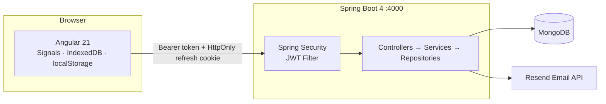

# Architecture Overview

> Executive summary of the Liftorium architecture.
> For component-level detail see [system-architecture.md](./system-architecture.md) and [backend-components.md](./backend-components.md).

---

## System Shape

Liftorium is a monorepo containing two runtimes and a shared documentation tree.

```
gym/
├── frontend/   Angular 21 SPA
├── backend/    Spring Boot 4 REST API
└── docs/       Architecture, API, decisions, progress
```

The frontend and backend are deployed independently and communicate exclusively over HTTP. There is no server-side rendering and no shared runtime.

---

## Runtime Overview



---

## Frontend

**Stack:** Angular 21, TypeScript, TailwindCSS 4, standalone components, lazy-loaded routes.

**State model:** Angular Signals. Every piece of live application state — the in-progress workout, user settings, the authenticated user, and the exercise catalog — is owned by a dedicated Signal-based store. There is no third-party state library.

**Offline support:** Unauthenticated users can log and complete full workouts without an account. Workout state is persisted in IndexedDB (`liftorium_guest_db`) with a localStorage fallback. On login, all offline workouts are bulk-synced to the backend via `WorkoutSyncService`. The exercise catalog is versioned and cached in IndexedDB so the app is usable in poor connectivity.

**Key stores:**

| Store | Responsibility |
|---|---|
| `AuthService` | Session state — user, access token, auth status |
| `LiveWorkoutStore` | In-progress workout — exercises, sets, rest timer, pause/resume |
| `UserSettingsStore` | User preferences — units, rest defaults, theme |
| `ExerciseStoreService` | Exercise catalog — cached in IndexedDB, version-gated re-download |

**HTTP layer:** `authInterceptor` attaches the Bearer access token to every outgoing request and automatically retries after a transparent token refresh on any 401 response.

---

## Backend

**Stack:** Java 21, Spring Boot 4.0.6, Maven, Spring Data MongoDB, Spring Security, JJWT 0.12.6, Lombok, Jakarta Validation.

**Layering:** All backend code follows a strict controller → service → repository pattern. Controllers handle HTTP routing and request validation only. Services contain all business logic. Repositories handle MongoDB access only. No layer skipping.

**Package structure:** `com.liftorium.*` with 14 sub-packages:

| Package | Responsibility |
|---|---|
| `config` | `AppProperties`, `SecurityConfig`, `JwtKeyConfig` |
| `controller` | 10 REST controllers under `/api/v1` |
| `dto` | Request/response records, `ApiResponse<T>` envelope |
| `service` | 15 services — auth, JWT, OTP, email, workout, exercise, progress, sync, settings |
| `repository` | 12 Spring Data MongoDB repositories |
| `entity` | 20 document models, embedded types, and enums |
| `security` | `JwtAuthenticationFilter`, `UserPrincipal`, `CustomUserDetailsService` |
| `exception` | `AppException`, `GlobalExceptionHandler` |
| `util` | `DurationParser` |
| `validation` | `@StrongPassword` constraint |
| `startup` | `ExerciseSyncRunner` — optional Wger catalog sync on boot |
| `provider` | `WgerExerciseProvider` |
| `cache` | `CatalogVersionCache` — in-memory exercise version cache |

See [backend-components.md](./backend-components.md) for the full class-level diagram.

---

## Authentication

Registration requires OTP email verification. Every session issues two JWTs:

- **Access token** — 15-minute TTL, stateless, transmitted as `Authorization: Bearer`. Stored in `localStorage` on the client.
- **Refresh token** — 30-day TTL, transmitted and stored as an `HttpOnly; SameSite=Strict` cookie. Persisted in MongoDB as an HMAC-SHA256 hash. Rotated on every use.

The `JwtAuthenticationFilter` runs before every protected request and validates the access token. The Angular `authInterceptor` handles transparent refresh.

See [auth-flow.md](./auth-flow.md) for full sequence diagrams covering registration, login, token refresh, password reset, and logout.

---

## Progress Evaluation Engine

`ProgressEvaluationService` runs exactly once per finished workout, triggered by `WorkoutService.finish()`. It never runs during live set entry.

Two phases:

1. **Session reduction** — all sets for each exercise are collapsed into a single session-best record. The metrics computed depend on the exercise's `TrackingType` (`WEIGHT_REPS`, `REPS_ONLY`, `DURATION`, `CARDIO`).
2. **Historical comparison** — the session record is compared against the athlete's all-time `ExerciseProgress`. At most one `PrEvent` is emitted per PR type per exercise per workout. One `ExerciseProgressHistory` snapshot is always written regardless of whether a PR occurred.

See [TRACKING_TYPES.md](./TRACKING_TYPES.md) for the full tracking type specification.

---

## Exercise Catalog

The exercise catalog is stored in the `exercises` collection. Each document carries a `trackingType` field that governs set validation and PR analytics. The catalog is versioned: the backend exposes a version number and the Angular frontend compares it against a locally cached value before deciding whether to re-download.

An optional `ExerciseSyncRunner` (`EXERCISE_SYNC_ON_STARTUP=true`) syncs exercises from the Wger external API on startup via `WgerExerciseProvider`.

---

## User Settings

Settings are stored in a dedicated `user_settings` collection, separate from `users`, so identity queries are never burdened by settings payload. Default settings are created atomically at account registration. The frontend `UserSettingsStore` applies updates optimistically and rolls back on API failure.

See [user-settings.md](./user-settings.md) for full design rationale and security considerations.

---

## Email

Transactional email (OTP verification, password reset) is delivered via the [Resend](https://resend.com) API using Spring's `RestClient`. No SMTP dependency. The `EmailService` calls `POST https://api.resend.com/emails` with a Bearer API key.

---

## Database

MongoDB with 11 collections. Three use TTL indexes for automatic expiry of short-lived documents (`refresh_tokens`, `pending_registrations`, `password_reset_requests`).

See [data-model.md](./data-model.md) for full collection schemas and indexing notes.

---

## Security Controls Summary

| Control | Implementation |
|---|---|
| Stateless sessions | `SessionCreationPolicy.STATELESS` |
| JWT validation | `JwtAuthenticationFilter` on every request |
| Refresh token storage | HMAC-SHA256 hash in MongoDB, never raw |
| Refresh token rotation | Revoke-and-reissue on every use |
| HttpOnly cookie | Refresh token inaccessible to JavaScript |
| Password hashing | BCrypt, configurable cost factor |
| OTP hashing | BCrypt via `OtpService` |
| OTP rate limiting | 3 attempts per 10-minute window |
| Enumeration protection | Forgot-password always returns success |
| Input validation | Jakarta Bean Validation + `@StrongPassword` |

See [security.md](./security.md) for the full security architecture.

---

## Core Principles

- Mobile-first, minimal-tap workout logging.
- Offline-first for guest users — IndexedDB persistence, sync on login.
- Strict layering — no business logic in controllers, no HTTP concerns in services.
- Environment-driven configuration — all secrets via environment variables, no committed credentials.
- Documentation updated alongside implementation.
