# System Architecture

> Generated from source code analysis. All components shown are implemented.

## Mermaid System Architecture Diagram

```mermaid
graph TB
    subgraph Client["Browser / Mobile"]
        User(["👤 User"])
        Angular["Angular 21\nStandalone Components\nLazy-loaded Routes"]
        Signals["Angular Signals\nLiveWorkoutStore\nUserSettingsStore\nExerciseStoreService\nAuthService"]
        IDB["IndexedDB\nliftorium_guest_db\n(active_workout / completed_workouts)\n+ localStorage fallback"]
        LS["localStorage\nAccess Token\nUser Settings Cache\nExercise Catalog Cache"]

        User --> Angular
        Angular --> Signals
        Signals --> IDB
        Signals --> LS
    end

    subgraph Interceptors["HTTP Layer (Angular)"]
        AuthInterceptor["authInterceptor\n(HttpInterceptorFn)\nAttaches Bearer token\n401 → auto-refresh retry"]
    end

    subgraph Backend["Spring Boot 4 — port 4000"]
        subgraph Security["Spring Security"]
            CORSFilter["CORS Filter\n(configured origins)"]
            JWTFilter["JwtAuthenticationFilter\n(OncePerRequestFilter)\nExtracts + validates access token\nSets SecurityContext"]
            EntryPoint["RestAuthenticationEntryPoint\nJSON 401 responses"]
        end

        subgraph Controllers["REST Controllers  /api/v1"]
            AuthCtrl["AuthController\n/auth/**"]
            WorkoutCtrl["WorkoutController\n/workouts/**"]
            ExerciseCtrl["ExerciseController\n/exercises/**"]
            PlanCtrl["WorkoutPlanController\n/workout-plans/**"]
            ProgressCtrl["ProgressController\n/progress/**"]
            HistoryCtrl["HistoryInsightsController\n/history/**"]
            SettingsCtrl["UserSettingsController\n/settings/**"]
            SyncCtrl["SyncController\n/sync/**"]
            AdminCtrl["AdminExerciseController\n/admin/exercises/**"]
            HealthCtrl["HealthController\n/health"]
        end

        subgraph Services["Service Layer"]
            AuthSvc["AuthService"]
            JwtSvc["JwtService\n(JJWT 0.12.6)"]
            OtpSvc["OtpService\n(SecureRandom + BCrypt)"]
            EmailSvc["EmailService\n(RestClient → Resend API)"]
            WorkoutSvc["WorkoutService"]
            ExerciseSvc["ExerciseService"]
            PlanSvc["WorkoutPlanService"]
            ProgressSvc["ProgressService"]
            ProgEvalSvc["ProgressEvaluationService\n(PR detection engine)"]
            SyncSvc["WorkoutSyncService"]
            StatsSvc["WorkoutStatsService"]
            HistorySvc["HistoryInsightsService"]
            SettingsSvc["UserSettingsService"]
            CatalogSvc["CatalogVersionService"]
            ExSyncSvc["ExerciseSyncService"]
        end

        subgraph Repositories["Repository Layer (Spring Data MongoDB)"]
            UserRepo["UserRepository"]
            RefreshRepo["RefreshTokenRepository"]
            PendingRepo["PendingRegistrationRepository"]
            PwdResetRepo["PasswordResetRequestRepository"]
            WorkoutRepo["WorkoutRepository"]
            ExerciseRepo["ExerciseRepository"]
            ExQueryRepo["ExerciseQueryRepository"]
            PlanRepo["WorkoutPlanRepository"]
            ProgressRepo["ExerciseProgressRepository"]
            HistoryRepo["ExerciseProgressHistoryRepository"]
            PrEventRepo["PrEventRepository"]
            SettingsRepo["UserSettingsRepository"]
        end
    end

    subgraph MongoDB["MongoDB Atlas"]
        Users[("users")]
        RefreshTokens[("refresh_tokens\n(TTL index)")]
        PendingRegs[("pending_registrations\n(TTL index)")]
        PwdResets[("password_reset_requests\n(TTL index)")]
        Workouts[("workouts")]
        Exercises[("exercises")]
        WorkoutPlans[("workout_plans")]
        ExProgress[("exercise_progress")]
        ExProgressHistory[("exercise_progress_history")]
        PrEvents[("pr_events")]
        UserSettings[("user_settings")]
    end

    subgraph External["External Services"]
        Resend["Resend Email API\nhttps://api.resend.com\n(OTP + password reset emails)"]
    end

    %% Client → Backend
    Angular -->|"HTTPS + withCredentials\nHttpOnly refresh cookie"| AuthInterceptor
    AuthInterceptor -->|"Bearer access token\nAuthorization header"| CORSFilter

    %% Security chain
    CORSFilter --> JWTFilter
    JWTFilter --> Controllers
    EntryPoint -.->|"401 JSON error"| Angular

    %% Controllers → Services
    AuthCtrl --> AuthSvc
    WorkoutCtrl --> WorkoutSvc
    ExerciseCtrl --> ExerciseSvc
    PlanCtrl --> PlanSvc
    ProgressCtrl --> ProgressSvc
    HistoryCtrl --> HistorySvc
    SettingsCtrl --> SettingsSvc
    SyncCtrl --> SyncSvc
    AdminCtrl --> ExerciseSvc

    %% Service interactions
    AuthSvc --> JwtSvc
    AuthSvc --> OtpSvc
    AuthSvc --> EmailSvc
    WorkoutSvc --> ProgEvalSvc
    ProgEvalSvc --> ProgressRepo
    ProgEvalSvc --> PrEventRepo
    ProgEvalSvc --> HistoryRepo
    SyncSvc --> WorkoutSvc
    SyncSvc --> ProgressSvc

    %% Services → Repositories
    AuthSvc --> UserRepo
    AuthSvc --> RefreshRepo
    AuthSvc --> PendingRepo
    AuthSvc --> PwdResetRepo
    AuthSvc --> SettingsRepo
    WorkoutSvc --> WorkoutRepo
    ExerciseSvc --> ExerciseRepo
    ExerciseSvc --> ExQueryRepo
    PlanSvc --> PlanRepo
    ProgressSvc --> ProgressRepo
    ProgressSvc --> PrEventRepo
    ProgressSvc --> HistoryRepo
    HistorySvc --> WorkoutRepo
    HistorySvc --> ProgressRepo
    StatsSvc --> WorkoutRepo
    SettingsSvc --> SettingsRepo
    CatalogSvc --> ExerciseRepo
    ExSyncSvc --> ExerciseRepo

    %% Repositories → MongoDB
    UserRepo --- Users
    RefreshRepo --- RefreshTokens
    PendingRepo --- PendingRegs
    PwdResetRepo --- PwdResets
    WorkoutRepo --- Workouts
    ExerciseRepo --- Exercises
    ExQueryRepo --- Exercises
    PlanRepo --- WorkoutPlans
    ProgressRepo --- ExProgress
    HistoryRepo --- ExProgressHistory
    PrEventRepo --- PrEvents
    SettingsRepo --- UserSettings

    %% Email
    EmailSvc -->|"POST /emails\nBearer RESEND_API_KEY"| Resend

    style Client fill:#1e293b,color:#e2e8f0
    style Backend fill:#0f172a,color:#e2e8f0
    style MongoDB fill:#14532d,color:#e2e8f0
    style External fill:#312e81,color:#e2e8f0
    style Security fill:#1e1b4b,color:#e2e8f0
    style Controllers fill:#0c1a2e,color:#e2e8f0
    style Services fill:#1a1a2e,color:#e2e8f0
    style Repositories fill:#0a1628,color:#e2e8f0
    style Interceptors fill:#1e293b,color:#e2e8f0
```

## Key Architectural Decisions

| Decision | Implementation |
|---|---|
| Token storage | Access token in `localStorage` (short-lived, 15 min); refresh token in `HttpOnly Secure SameSite=Strict` cookie |
| Stateless backend | `SessionCreationPolicy.STATELESS` — no server-side session |
| Refresh token security | Stored as `HMAC-SHA256` hash in MongoDB, rotated on every use |
| Guest offline support | IndexedDB (`idb`) with localStorage fallback; sync on login via `WorkoutSyncService` |
| Exercise catalog caching | Versioned paginated download cached in IndexedDB (`ExerciseCacheInitializer` at `APP_INITIALIZER`) |
| OTP security | 6-digit `SecureRandom`, bcrypt-hashed at rest, TTL-indexed MongoDB document, rate-limited (3/10 min) |
| Progress evaluation | Triggered once at `WorkoutService.finish()` — never during live set entry |
